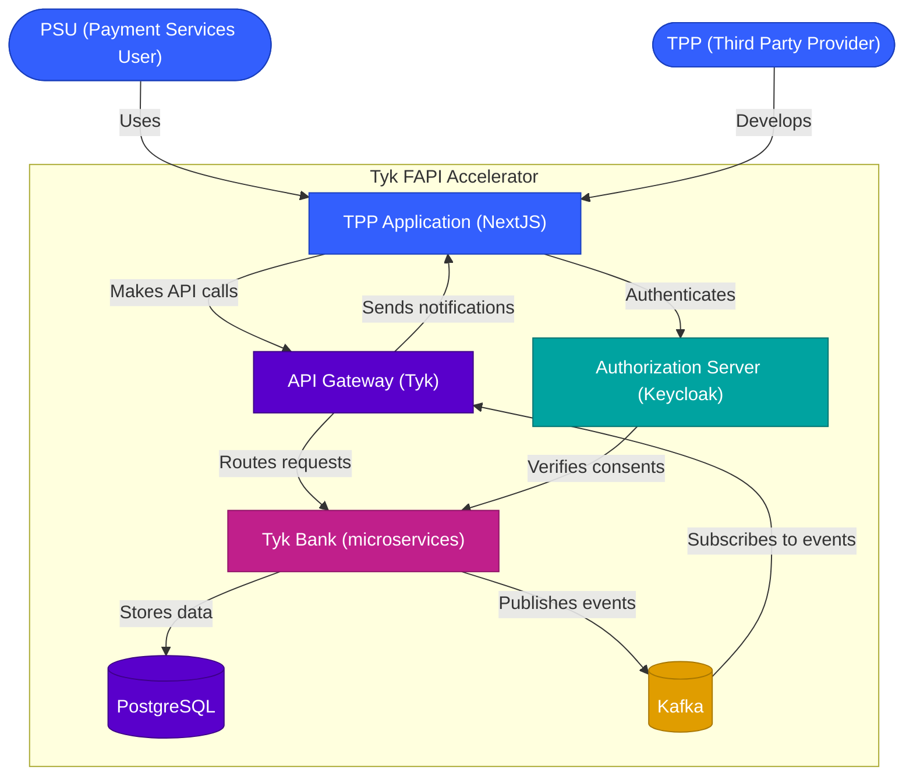

# Tyk FAPI Accelerator

This repository serves as an industry accelerator for implementing Financial-grade API (FAPI) and Demonstrating Proof of Possession (DPoP) with Tyk API Gateway. It provides a complete reference implementation of FAPI-compliant APIs, including security features, event notifications, and example applications that demonstrate how third-party providers can interact with financial institutions securely.

### Value for Financial Institutions (ASPSPs)

For banks and financial institutions (Account Servicing Payment Service Providers):

- **Accelerated Compliance**: Rapidly implement FAPI-compliant APIs to meet regulatory requirements for Open Banking and PSD2
- **Reduced Development Costs**: Leverage pre-built components instead of building from scratch, cutting development time by up to 70%
- **Enhanced Security**: Implement industry-leading security practices with DPoP, idempotency checks, and JWS message signing
- **Simplified Integration**: Use standardized APIs that follow Open Banking specifications, making it easier for TPPs to integrate
- **Future-Proof Architecture**: Modular design allows for easy updates as standards evolve and new requirements emerge
- **Complete Event System**: Built-in event notification system for real-time updates to TPPs about payment and consent status changes

### Value for Third-Party Providers (TPPs)

For fintechs and service providers consuming banking APIs:

- **Simplified Integration**: Standardized APIs with comprehensive documentation and SDKs reduce integration time
- **Reference Implementation**: Example TPP application demonstrates best practices for secure API consumption
- **Enhanced User Experience**: Support for both automatic and manual authorization flows to accommodate various user journeys
- **Real-time Updates**: Event subscription system provides immediate notifications about relevant changes
- **Security Compliance**: Built-in support for FAPI security requirements, reducing compliance burden
- **Multi-country Support**: Designed to work with various Open Banking standards, enabling international expansion

## What is FAPI and DPoP?

### Financial-grade API (FAPI)

Financial-grade API (FAPI) is a security profile defined by the OpenID Foundation that builds on OAuth 2.0 and OpenID Connect to provide enhanced security for financial services APIs. FAPI is designed to address the specific security requirements of financial transactions, including:

- Enhanced authentication and authorization
- Protection against various attack vectors
- Secure message signing and encryption
- Strict protocol enforcement

FAPI is widely adopted in Open Banking initiatives around the world, including the UK Open Banking Standard, the European PSD2 directive, and similar regulations in Australia, Brazil, and other countries.

### Demonstrating Proof of Possession (DPoP)

DPoP is an extension to OAuth 2.0 that provides a mechanism for clients to prove possession of a private key corresponding to a public key bound to an access token. This prevents token theft and replay attacks by ensuring that only the legitimate holder of the private key can use the token.

Key features of DPoP include:

- Cryptographic binding of tokens to key pairs
- Prevention of token theft and replay attacks
- Support for various signature algorithms (ES256, RS256, etc.)
- Compatibility with existing OAuth 2.0 flows

## Architecture Overview

The Tyk FAPI Accelerator implements a complete FAPI ecosystem with the following components:



For more detailed architecture diagrams, see the [docs directory](docs/README.md), which includes:

- [Context Diagram](docs/context-diagram.md) - High-level system overview
- [Container Diagram](docs/container-diagram.md) - Major components and their interactions
- [Sequence Diagrams](docs/payment-flow-sequence-diagram.md) - Detailed flow of operations

## Repository Structure

This is a monorepo containing multiple sub-applications and components:

- **plugins/**: Gateway plugins for Tyk
  - **tyk-grpc-plugin/**: gRPC plugin implementing DPoP authentication, idempotency checks, and JWS message signing for FAPI compliance
  - **api-definitions/**: Tyk API definitions for various Open Banking APIs
  
- **authorization-servers/**: Configurations for FAPI-compliant authorization servers
  - **keycloak/**: Keycloak setup with FAPI 2.0 and DPoP support, including custom themes and client policies
  
- **sdks/**: Client SDKs for different languages with examples
  - **java/**: Java SDK and examples for interacting with FAPI-compliant APIs
  
- **specs/**: Open Banking specifications and reference implementations
  - **uk-open-banking/**: UK Open Banking Read/Write API specifications with UML diagrams
  
- **tyk-bank/**: Mock bank implementation with microservices architecture for testing FAPI compliance
  - Implements UK Open Banking Account Information API
  - Implements UK Open Banking Payment Initiation API (Domestic Payments)
  - Implements UK Open Banking Event Subscriptions API
  - Supports event notifications for payment and consent events
  - Containerized microservices for scalability and resilience
  - Extensible for multiple countries' Open Banking standards
  
- **tpp/**: Third-Party Provider implementation
  - NextJS application that connects to the mock bank API
  - Implements FAPI 2.0 security profile with Pushed Authorization Requests (PAR)
  - Demonstrates account information retrieval and payment initiation
  - Supports receiving event notifications from the bank
  - Supports both automatic and manual authorization flows
  
- **docs/**: Documentation
  - Architecture diagrams following C4 model principles
  - Sequence diagrams for key flows
  - API analysis and integration guides

## Getting Started

### Prerequisites

- Go 1.24 or higher
- Tyk API Gateway
- Docker and Docker Compose
- Node.js 14+ (for running the mock bank and TPP application)
- PostgreSQL (for the mock bank database)
- Kafka (for event notifications)

### Complete Setup Guide

1. **Clone the repository**
   ```bash
   git clone https://github.com/TykTechnologies/tyk-fapi.git
   cd tyk-fapi
   ```

2. **Start the required services**
   ```bash
   ./start-services.sh
   ```
   This script starts PostgreSQL, Kafka, and other required services using Docker Compose.

3. **Set up the Authorization Server**
   ```bash
   cd authorization-servers/keycloak
   ./setup-fapi-realm.sh
   ```
   This sets up Keycloak with FAPI 2.0 and DPoP support.

4. **Build and run the gRPC plugin**
   ```bash
   cd plugins/tyk-grpc-plugin
   docker-compose up -d
   ```
   This builds and runs the gRPC plugin that implements DPoP authentication and idempotency checks.

5. **Run the mock bank**
   ```bash
   cd tyk-bank
   npm install
   npm start
   ```
   This starts the mock bank implementation with Open Banking APIs.

6. **Run the TPP application**
   ```bash
   cd tpp
   npm install
   npm run dev
   ```
   This starts the TPP application that demonstrates how to interact with the bank APIs.

7. **Access the TPP application**
   Open [http://localhost:3000](http://localhost:3000) in your browser to access the TPP application.

### Troubleshooting

- **Keycloak Issues**: If you encounter issues with Keycloak, check the logs with `docker logs keycloak` and ensure the FAPI realm was imported correctly.
- **gRPC Plugin Issues**: If the gRPC plugin is not working, check that it's running with `docker ps` and that Tyk is configured to use it.
- **TPP Application Issues**: If the TPP application can't connect to the APIs, check the `.env.local` file and ensure the URLs are correct.

For more detailed instructions, see the README.md files in each component's directory.

## Security Features

The Tyk FAPI Accelerator implements several security features to ensure compliance with FAPI standards:

### gRPC Plugin Security Features

The gRPC plugin provides critical security features for FAPI compliance:

1. **DPoP Validation**:
   - Validates DPoP proof and claims in a single step
   - Checks for the existence of Authorization and DPoP headers
   - Extracts the DPoP fingerprint (jkt) from the token
   - Validates the DPoP proof against the fingerprint
   - Prevents token theft and replay attacks

2. **Idempotency Checks**:
   - Ensures that repeated requests with the same idempotency key produce the same result
   - Validates idempotency keys in request headers
   - Caches responses for idempotent requests
   - Returns cached responses for repeated requests with the same idempotency key
   - Includes automatic garbage collection of expired idempotency entries

3. **JWS Message Signing**:
   - Signs webhook payloads using JSON Web Signature (JWS)
   - Ensures the authenticity and integrity of event notifications
   - Allows TPPs to verify that notifications haven't been tampered with

### Authorization Server Security

The Keycloak authorization server is configured with FAPI 2.0 security profile:

- FAPI 2.0 compliant settings
- DPoP support enabled
- ES256 signature algorithm for tokens
- Support for both confidential and public clients
- Pushed Authorization Requests (PAR) support

## Event Notification System

The Tyk FAPI Accelerator includes a complete event notification system that allows the bank to notify TPPs of significant events:

### Event Types

- **Payment Events**: Payment status changes, payment cancellations, etc.
- **Consent Events**: Consent status changes, consent expirations, etc.
- **Account Events**: Balance changes, transaction postings, etc.

### Event Flow

1. The Tyk Bank publishes events to Kafka when significant events occur
2. The Event Dispatcher API in the API Gateway consumes these Kafka events
3. The Event Dispatcher identifies which TPPs should receive the notifications based on their subscriptions
4. The Event Dispatcher constructs the webhook payload and forwards it to the Event Notification Forwarder API
5. The Event Notification Forwarder API signs the webhook payload using JSON Web Signature (JWS)
6. The signed notifications are sent to the appropriate TPPs' callback URLs
7. TPPs can verify the authenticity of the webhooks using the JWS signature

### Subscription Management

TPPs can subscribe to events using the Event Subscriptions API, which allows them to:

- Create, read, update, and delete event subscriptions
- Specify which event types they want to receive
- Provide callback URLs for event delivery
- Set filters for specific events (e.g., specific accounts or payments)

## Compliance and Standards

The Tyk FAPI Accelerator is designed to comply with various Open Banking standards and regulations:

### UK Open Banking

- Implements UK Open Banking Read/Write API specifications
- Supports Account Information, Payment Initiation, and Event Notification APIs
- Follows UK Open Banking security profile

### FAPI 2.0

- Implements FAPI 2.0 security profile
- Supports DPoP for enhanced security
- Implements Pushed Authorization Requests (PAR)
- Follows FAPI 2.0 message signing requirements

### OAuth 2.0 and OpenID Connect

- Implements OAuth 2.0 and OpenID Connect protocols
- Supports various grant types (Authorization Code, Client Credentials, etc.)
- Implements PKCE for public clients
- Supports JWT-based tokens with ES256 signatures

## Demo and Examples

### API Examples

#### Account Information API

```http
GET /account-information/accounts HTTP/1.1
Host: api.example.com
Authorization: DPoP eyJhbGciOiJFUzI1NiIsInR5cCI6IkpXVCJ9...
DPoP: eyJhbGciOiJFUzI1NiIsInR5cCI6ImRwb3Arand0IiwiandrIjp7Imt0eSI6IkVDIiwiY3J2IjoiUC0yNTYiLCJ4IjoiVVpFWFg3WmVzdWJZUmU0UkVnaDBTWl9lNmpoNTI2ZUxQVFRQQmJCX1RtYyIsInkiOiJfMFcwZzJEMG5VbzJ4MnRPbkZYaDEwdlRQT1diNGxPTEpkZ1A4MlF5MnVzIn19...
```

#### Payment Initiation API

```http
POST /payment-initiation/domestic-payments HTTP/1.1
Host: api.example.com
Content-Type: application/json
X-Idempotency-Key: 550e8400-e29b-41d4-a716-446655440000
Authorization: DPoP eyJhbGciOiJFUzI1NiIsInR5cCI6IkpXVCJ9...
DPoP: eyJhbGciOiJFUzI1NiIsInR5cCI6ImRwb3Arand0IiwiandrIjp7Imt0eSI6IkVDIiwiY3J2IjoiUC0yNTYiLCJ4IjoiVVpFWFg3WmVzdWJZUmU0UkVnaDBTWl9lNmpoNTI2ZUxQVFRQQmJCX1RtYyIsInkiOiJfMFcwZzJEMG5VbzJ4MnRPbkZYaDEwdlRQT1diNGxPTEpkZ1A4MlF5MnVzIn19...

{
  "Data": {
    "ConsentId": "58923",
    "Initiation": {
      "InstructionIdentification": "ACME412",
      "EndToEndIdentification": "FRESCO.21302.GFX.20",
      "InstructedAmount": {
        "Amount": "165.88",
        "Currency": "GBP"
      },
      "CreditorAccount": {
        "SchemeName": "UK.OBIE.SortCodeAccountNumber",
        "Identification": "08080021325698",
        "Name": "ACME Inc"
      },
      "RemittanceInformation": {
        "Reference": "FRESCO-101",
        "Unstructured": "Internal ops code 5120101"
      }
    }
  },
  "Risk": {
    "PaymentContextCode": "EcommerceGoods",
    "MerchantCategoryCode": "5967",
    "MerchantCustomerIdentification": "053598653254",
    "DeliveryAddress": {
      "AddressLine": [
        "Flat 7",
        "Acacia Lodge"
      ],
      "StreetName": "Acacia Avenue",
      "BuildingNumber": "27",
      "PostCode": "GU31 2ZZ",
      "TownName": "Sparsholt",
      "CountrySubDivision": "Wessex",
      "Country": "UK"
    }
  }
}
```

### Authorization Flow

The TPP application demonstrates both automatic and manual authorization flows:

1. **Automatic Flow**:
   - TPP redirects the user to the authorization server
   - User authenticates and authorizes the TPP
   - Authorization server redirects back to the TPP with an authorization code
   - TPP exchanges the authorization code for an access token
   - TPP uses the access token to access the user's resources

2. **Manual Flow**:
   - TPP generates a QR code or deep link
   - User scans the QR code or clicks the deep link
   - User is redirected to the authorization server
   - User authenticates and authorizes the TPP
   - Authorization server redirects the user back to their banking app
   - TPP polls for authorization completion
   - Once authorized, TPP can access the user's resources

## Contributing

Please read [CONTRIBUTING.md](CONTRIBUTING.md) for details on our code of conduct and the process for submitting pull requests.

## License

This project is licensed under the MIT License - see the LICENSE file for details.
