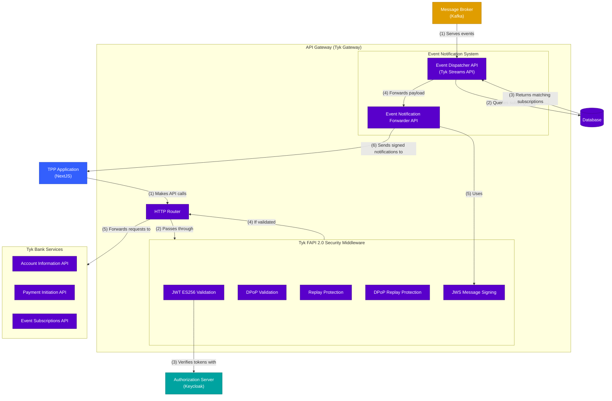

# API Gateway - Container Diagram

This diagram shows the internal structure of the API Gateway component in the Tyk FAPI Accelerator.

## Description

The API Gateway container diagram shows the internal components of the Tyk Gateway and their relationships:

### Core Components

1. **HTTP Router**: The central component of the API Gateway responsible for:
   - Receiving HTTP requests from TPP applications
   - Matching requests to the appropriate API definition
   - Applying security rules via the Tyk FAPI 2.0 Security Middleware
   - Forwarding validated requests to the appropriate Tyk Bank Service

### Tyk FAPI 2.0 Security Middleware

The API Gateway implements several security middleware components specifically for FAPI 2.0 compliance:

1. **JWT ES256 Validation**: Verifies JSON Web Tokens using the ES256 algorithm, including their signatures, claims, and scopes. Ensures that tokens are valid, not expired, and contain the appropriate permissions for the requested operation.

2. **DPoP Validation**: Implements Demonstrating Proof of Possession (DPoP) token validation, which binds access tokens to a specific client to prevent token theft and misuse. This is a critical security feature for financial-grade APIs.

3. **Replay Protection**: Prevents replay attacks by validating idempotency keys and nonces. Ensures that the same request cannot be maliciously replayed, which is essential for payment operations.

4. **DPoP Replay Protection**: Specific protection against replaying DPoP proofs, which could otherwise be used to impersonate legitimate clients.

5. **JWS Message Signing**: Signs event notifications using JSON Web Signature (JWS) to ensure authenticity and integrity of notifications sent to TPPs.

### Tyk Bank Services

The Tyk Bank provides several API services that handle different aspects of the system:

1. **Account Information API**: Endpoints for retrieving account information, balances, and transactions.

2. **Payment Initiation API**: Endpoints for creating payment consents and payments.

3. **Event Subscriptions API**: Endpoints for managing event subscriptions and notifications.

This is a mock bank, which was created by importing the UK Open Banking OpenAPI Specification Docs.

### Event Notification System

The Event Notification System handles the processing and delivery of event notifications:

1. **Event Dispatcher API**: A Tyk Streams API that consumes events from Kafka, queries the database for matching subscriptions, and constructs the webhook payload. It then forwards the payload to the Event Notification Forwarder API.

2. **Event Notification Forwarder API**: Responsible for signing the webhook payload using a pre-determined private key with JWS (JSON Web Signature) and delivering the signed notifications to the target TPP callback URLs.

### Key Flows

#### API Request Flow

1. TPP Application makes API calls to the HTTP Router
2. HTTP Router passes requests through Tyk FAPI 2.0 Security Middleware
3. JWT ES256 Validation verifies tokens with the Authorization Server
4. Tyk FAPI 2.0 Security Middleware returns validated requests to the HTTP Router
5. The HTTP Router forwards requests to the appropriate Tyk Bank Service

#### Event Notification Flow

1. Kafka publishes events to the Event Dispatcher API
2. Event Dispatcher API queries the Database for matching subscriptions
3. Database returns the matching subscriptions
4. Event Dispatcher API forwards the payload to the Event Notification Forwarder API
5. Event Notification Forwarder API uses JWS Message Signing with a pre-determined private key
6. Event Notification Forwarder API sends the signed notifications to the target TPP callback URLs
