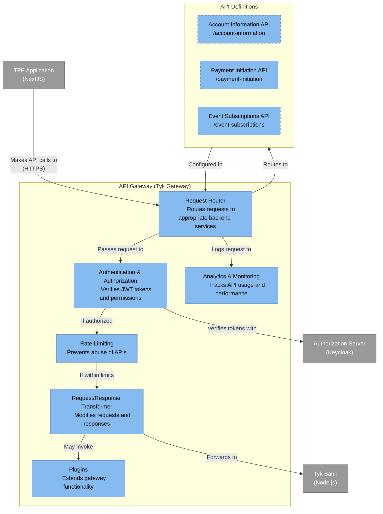

# API Gateway - Container Diagram

This diagram shows the internal structure of the API Gateway component in the Tyk FAPI Accelerator.

## Description

The API Gateway container diagram shows the internal components of the Tyk Gateway:

1. **Request Router**: Routes incoming requests to the appropriate backend services based on the API definitions. From our API analysis, we can see it's configured to route requests to endpoints like `/account-information`, `/payment-initiation`, and `/event-subscriptions`.

2. **Authentication & Authorization**: Verifies JWT tokens and permissions. Based on the API analysis, it uses JWT authentication with tokens from the Authorization Server.

3. **Rate Limiting**: Prevents abuse of APIs by limiting the number of requests from a client within a time period.

4. **Request/Response Transformer**: Modifies requests before they reach the backend and responses before they're returned to the client. This can include adding headers, transforming data formats, etc.

5. **Plugins**: Extends the gateway functionality. From the API analysis, we can see plugins for features like DPoP (Demonstrating Proof of Possession) and idempotency checks.

6. **Analytics & Monitoring**: Tracks API usage and performance metrics.

The diagram also shows the API definitions configured in the gateway:

1. **Account Information API**: Endpoints for retrieving account information, balances, and transactions. The API analysis shows it's available at `/account-information`.

2. **Payment Initiation API**: Endpoints for creating payment consents and payments. The API analysis shows it's available at `/payment-initiation`.

3. **Event Subscriptions API**: Endpoints for managing event subscriptions and notifications. The API analysis shows it's available at `/event-subscriptions`.

The key relationships shown in the diagram include:

- The TPP Application makes API calls to the Request Router
- The Request Router routes requests based on the API Definitions
- The Authentication component verifies tokens with the Authorization Server
- The Request/Response Transformer forwards requests to the Tyk Bank
- The Request Router logs requests to the Analytics & Monitoring component

This architecture provides several benefits:

- Centralized API management and security
- Consistent authentication and authorization across all APIs
- Protection against abuse through rate limiting
- Extensibility through plugins
- Visibility into API usage and performance