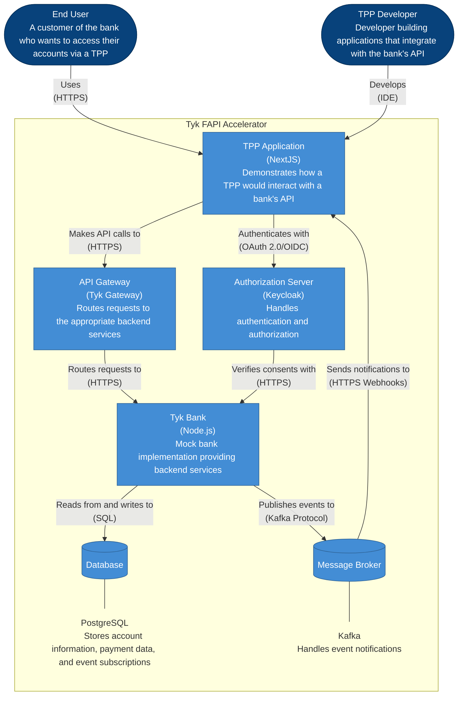

# Tyk FAPI Accelerator - Container Diagram

This diagram shows the major containers (applications, data stores) that make up the Tyk FAPI Accelerator system.

## Description

The container diagram shows the major components of the Tyk FAPI Accelerator:

1. **TPP Application**: A NextJS application that demonstrates how a third-party provider would interact with a bank's API. It provides a user interface for viewing account information, initiating payments, and testing authorization flows.

2. **API Gateway**: The Tyk Gateway that routes requests to the appropriate backend services. Based on the API analysis, it's configured to handle account information and payment initiation requests, with endpoints for accounts, balances, transactions, and more.

3. **Authorization Server**: A Keycloak instance that handles authentication and authorization. It supports OAuth 2.0 and OpenID Connect protocols, and is responsible for issuing tokens and managing consent.

4. **Tyk Bank**: A Node.js mock bank implementation that provides the backend services. It includes modules for account information, payment initiation, and event subscriptions.

5. **Database**: A PostgreSQL database that stores account information, payment data, and event subscriptions.

6. **Message Broker**: A Kafka instance that handles event notifications, allowing the bank to notify TPPs of events like payment status changes.

The diagram also shows the key relationships between these components, including:

- The TPP Application makes API calls to the API Gateway
- The TPP Application authenticates with the Authorization Server
- The API Gateway routes requests to the Tyk Bank
- The Authorization Server verifies consents with the Tyk Bank
- The Tyk Bank reads from and writes to the Database
- The Tyk Bank publishes events to the Message Broker
- The Message Broker sends notifications to the TPP Application