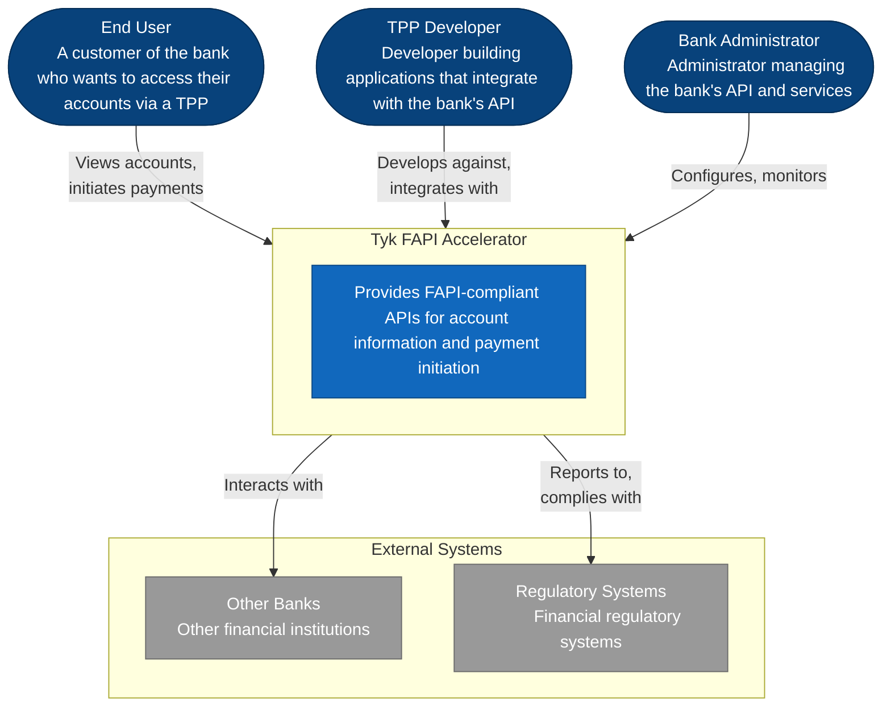

# Tyk FAPI Accelerator - Context Diagram

This diagram shows the Tyk FAPI Accelerator system in its environment, including users, external systems, and key actors.

## Description

The context diagram shows the Tyk FAPI Accelerator system and its interactions with:

1. **End Users**: Customers of the bank who access their accounts and initiate payments through third-party providers
2. **TPP Developers**: Developers who build applications that integrate with the bank's API
3. **Bank Administrators**: Staff who configure and monitor the bank's API and services
4. **Other Banks**: External financial institutions that may interact with the system
5. **Regulatory Systems**: Financial regulatory systems that the accelerator must comply with

This high-level view establishes the boundaries of the system and its external dependencies.