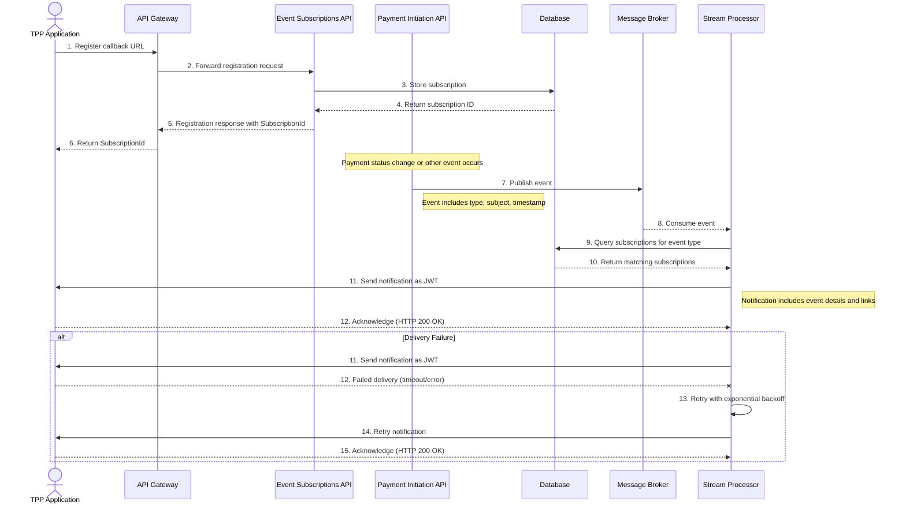

# Event Notification Flow - Sequence Diagram

This diagram shows the sequence of interactions between components during the event notification process in the Tyk FAPI Accelerator.

## Description

The event notification sequence diagram shows the interactions between components during the event notification process:

### Subscription Registration
1. The TPP Application registers a callback URL with the API Gateway
2. The API Gateway forwards the registration request to the Event Subscriptions API
3. The Event Subscriptions API stores the subscription in the Database
4. The Database returns the subscription ID
5. The Event Subscriptions API returns the registration response with the SubscriptionId
6. The API Gateway forwards the response to the TPP

### Event Generation
7. When a payment status change or other event occurs in the Payment Initiation API, it publishes an event to Kafka
   - The event includes the event type, subject, and timestamp

### Event Processing
8. The Stream Processor consumes the event from Kafka
9. The Stream Processor queries the Database for subscriptions matching the event type
10. The Database returns the matching subscriptions

### Notification Delivery
11. The Stream Processor sends a notification as a JWT to the TPP
    - The notification includes event details and links to the relevant resources
12. The TPP acknowledges the notification with an HTTP 200 OK response

### Error Handling (Alternative Flow)
In case of delivery failure:
11. The Stream Processor sends a notification as a JWT to the TPP
12. The delivery fails due to a timeout or error
13. The Stream Processor implements a retry mechanism with exponential backoff
14. The Stream Processor retries the notification
15. The TPP acknowledges the notification with an HTTP 200 OK response

This sequence diagram illustrates the complete event notification flow, from subscription registration to notification delivery, including error handling with retries.

According to the EVENT_NOTIFICATIONS.md document, the following event types are supported:
- `payment-consent-created`: When a TPP creates a new payment consent
- `payment-consent-authorised`: When a PSU authorizes a payment consent
- `payment-consent-rejected`: When a PSU rejects a payment consent
- `payment-created`: When a TPP creates a new payment
- `payment-completed`: When a payment is successfully processed
- `payment-failed`: When a payment processing fails
- `funds-confirmation-completed`: When a funds confirmation check is performed