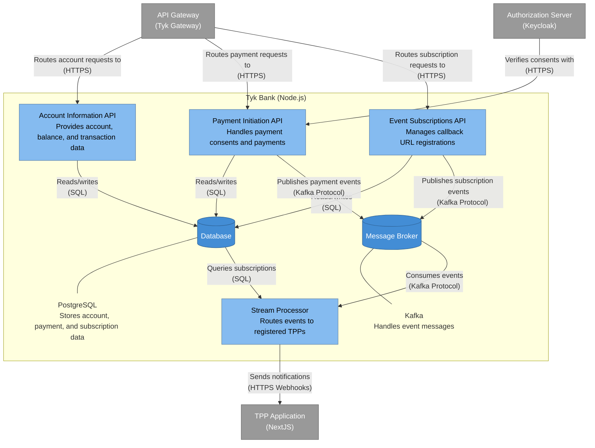

# Tyk Bank - Container Diagram

This diagram shows the internal structure of the Tyk Bank component, which is the mock bank implementation in the Tyk FAPI Accelerator.

## Description

The Tyk Bank container diagram shows the internal components of the mock bank implementation:

1. **Account Information API**: Provides endpoints for retrieving account information, balances, and transactions. Based on the API analysis, this includes endpoints for accounts, balances, transactions, and more.

2. **Payment Initiation API**: Handles payment consents and payments. It manages the lifecycle of a payment from consent creation to completion.

3. **Event Subscriptions API**: Manages callback URL registrations from TPPs. It allows TPPs to register for notifications when certain events occur.

4. **Stream Processor**: Routes events to registered TPPs. It consumes events from Kafka, queries the database for active subscriptions, and sends notifications to the registered TPPs.

5. **Database**: A PostgreSQL database that stores account information, payment data, and event subscriptions.

6. **Message Broker**: A Kafka instance that handles event messages, allowing different components to communicate asynchronously.

The diagram also shows the key relationships between these components:

- The API Gateway routes requests to the appropriate API components
- The Authorization Server verifies consents with the Payment Initiation API
- All API components read from and write to the Database
- The Payment Initiation API and Event Subscriptions API publish events to Kafka
- The Stream Processor consumes events from Kafka
- The Stream Processor queries the Database for active subscriptions
- The Stream Processor sends notifications to the TPP Application

This architecture provides several benefits:

- Separation of concerns between different API domains
- Asynchronous event processing with Kafka
- Persistent storage of subscriptions in PostgreSQL
- Scalable webhook delivery through the Stream Processor