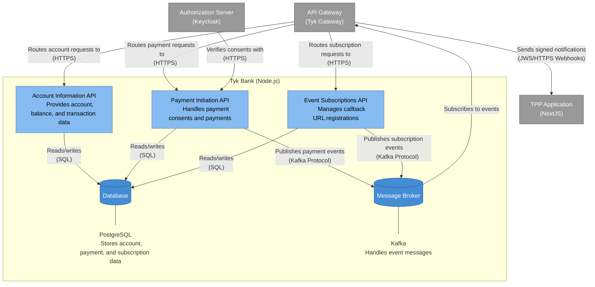

# Tyk Bank - Container Diagram

This diagram shows the internal structure of the Tyk Bank component, which is the mock bank implementation in the Tyk FAPI Accelerator.

## Description

The Tyk Bank container diagram shows the internal components of the mock bank implementation:

1. **Account Information API**: Provides endpoints for retrieving account information, balances, and transactions. Based on the API analysis, this includes endpoints for accounts, balances, transactions, and more.

2. **Payment Initiation API**: Handles payment consents and payments. It manages the lifecycle of a payment from consent creation to completion.

3. **Event Subscriptions API**: Manages callback URL registrations from TPPs. It allows TPPs to register for notifications when certain events occur.

4. **Database**: A PostgreSQL database that stores account information, payment data, and event subscriptions.

5. **Message Broker**: A Kafka instance that handles event messages, allowing different components to communicate asynchronously.

The diagram also shows the key relationships between these components:

- The API Gateway routes requests to the appropriate API components
- The Authorization Server verifies consents with the Payment Initiation API
- All API components read from and write to the Database
- The Payment Initiation API and Event Subscriptions API publish events to Kafka

### Event Notification Flow

The event notification flow has been simplified to show:

1. The Payment Initiation API and Event Subscriptions API publish events to Kafka when significant events occur (e.g., payment status changes)
2. The API Gateway subscribes to these Kafka events
3. The API Gateway determines which TPPs should receive the notifications based on their subscriptions
4. The API Gateway signs the webhook requests using JSON Web Signature (JWS)
5. The signed notifications are sent to the appropriate TPPs
6. TPPs can verify the authenticity of the webhooks using the JWS signature, ensuring they haven't been tampered with

This architecture provides several benefits:

- Separation of concerns between different API domains
- Asynchronous event processing with Kafka
- Persistent storage of subscriptions in PostgreSQL
- Secure webhook delivery through JWS signing
- Centralized event routing and delivery through the API Gateway