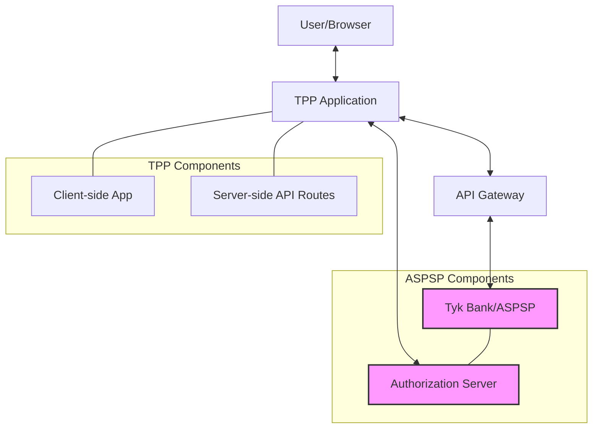

# System Architecture

This document provides an overview of the system architecture for the Tyk FAPI Accelerator, focusing on how the different components interact with each other.

## Overview

The Tyk FAPI Accelerator demonstrates a complete Financial-grade API (FAPI) implementation with the following components:

- **TPP (Third-Party Provider)**: A NextJS application that acts as a client to the bank's API
- **API Gateway**: Routes requests to the appropriate backend services
- **Authorization Server**: Handles authentication and authorization
- **Tyk Bank**: A mock bank implementation that provides the backend services

## Architecture Diagram

## Component Descriptions

### TPP (Third-Party Provider)

The TPP is a NextJS application that demonstrates how a third-party provider would interact with a bank's API. It provides a user interface for:

- Viewing account information and balances
- Viewing transaction history
- Initiating domestic payments
- Testing both automatic and manual authorization flows

The TPP communicates with the API Gateway for most operations, but also has direct communication with the Authorization Server for certain authorization flows.

### API Gateway

The API Gateway routes requests to the appropriate backend services. It handles:

- Request routing
- Authentication and authorization
- Rate limiting
- Request/response transformation

### Authorization Server

The Authorization Server handles authentication and authorization for the system. It is responsible for:

- Handling Pushed Authorization Requests (PAR)
- Managing consent authorizations
- Issuing authorization codes
- Redirecting users back to the TPP after authorization

In this implementation, the Authorization Server is self-hosted by the ASPSP (Tyk Bank).

### Tyk Bank (ASPSP)

The Tyk Bank is a mock implementation of an Account Servicing Payment Service Provider (ASPSP). It provides:

- Account Information API
- Payment Initiation API
- Consent management
- Payment processing

## Communication Flows

### Account Information Flow

1. The TPP requests account information from the API Gateway
2. The API Gateway forwards the request to the Tyk Bank
3. The Tyk Bank returns the account information
4. The API Gateway forwards the response to the TPP
5. The TPP displays the account information to the user

### Payment Flow

See [Payment Flow](./payment-flow.md) for a detailed explanation of the payment flow.

## Security Considerations

The system implements the FAPI 2.0 security profile, which includes:

- OAuth 2.0 with Pushed Authorization Requests (PAR)
- TLS 1.2+ for all communications
- JWT-based tokens
- PKCE (Proof Key for Code Exchange)
- Strict redirect URI validation

## Configuration

Each component has its own configuration options. See the respective README files for details:

- [TPP README](../tpp/README.md)
- [Tyk Bank README](../tyk-bank/README.md)
- [Authorization Server README](../authorization-servers/README.md)