# Authorization Options

This document provides a detailed explanation of the authorization options available in the Tyk FAPI Accelerator, focusing on the differences between automatic and manual authorization.

## Overview

The TPP application supports two authorization methods:

1. **Automatic Authorization**: A simplified flow where the TPP directly authorizes the payment consent without redirecting the user to the Authorization Server.
2. **Manual Authorization**: The complete FAPI 2.0 flow where the user is redirected to the Authorization Server to explicitly approve the payment.

## Authorization Options Comparison

```mermaid
flowchart TB
    subgraph "Automatic Authorization"
        Auto1[TPP directly authorizes consent]
        Auto2[Server-side API call]
        Auto3[No user interaction with Auth Server]
        Auto4[Faster, simpler flow]
        Auto5[For testing/development]
        
        Auto1 --> Auto2 --> Auto3 --> Auto4 --> Auto5
    end
    
    subgraph "Manual Authorization"
        Manual1[User redirected to Auth Server]
        Manual2[User explicitly approves]
        Manual3[Auth Server redirects back to TPP]
        Manual4[More secure, realistic flow]
        Manual5[Simulates real-world scenario]
        
        Manual1 --> Manual2 --> Manual3 --> Manual4 --> Manual5
    end
    
    classDef auto fill:#d4f1f9,stroke:#333;
    classDef manual fill:#ffecb3,stroke:#333;
    class Auto1,Auto2,Auto3,Auto4,Auto5 auto;
    class Manual1,Manual2,Manual3,Manual4,Manual5 manual;
```



## Automatic Authorization

Automatic authorization is a simplified flow where the TPP directly authorizes the payment consent without redirecting the user to the Authorization Server. This is useful for testing and development purposes.

### How Automatic Authorization Works

1. The user initiates a payment in the TPP application
2. The TPP creates a payment consent through the API Gateway
3. The TPP sends a Pushed Authorization Request (PAR) to the Authorization Server
4. The user selects "Authorize Automatically" in the TPP application
5. The TPP makes a direct server-side API call to authorize the consent
6. The TPP creates the payment using the authorized consent
7. The TPP displays a payment confirmation to the user

### Implementation Details

The automatic authorization is implemented in the `AuthorizationOptions` component:

```typescript
const handleAutomaticAuthorization = async () => {
  try {
    // Directly authorize the consent
    await authorizeConsentMutation.mutateAsync(consent.Data.ConsentId);
    onAuthorized();
  } catch (error) {
    console.error('Error authorizing consent:', error);
  }
};
```

The `authorizeConsentMutation` uses the `authorizePaymentConsent` function from the payments API:

```typescript
const authorizePaymentConsent = async (consentId: string): Promise<DomesticPaymentConsentResponse> => {
  try {
    const response = await axios.put<DomesticPaymentConsentResponse>(
      `${API_URL}/domestic-payment-consents/${consentId}/authorize`
    );
    return response.data;
  } catch (error) {
    // Error authorizing payment consent
    throw error;
  }
};
```

The server-side API route handles the authorization request:

```typescript
export async function PUT(
  request: NextRequest,
  { params }: { params: { consentId: string } }
) {
  try {
    const consentId = params?.consentId;
    
    if (!consentId) {
      console.error('Missing consentId parameter');
      return NextResponse.json(
        { error: 'Missing consentId parameter' },
        { status: 400 }
      );
    }
    
    console.log(`Server-side API route: Authorizing payment consent ${consentId} via Authorization Server`);
    
    const authServerUrl = `${AUTHORIZATION_SERVER_URL}/domestic-payment-consents/${consentId}/authorize`;
    console.log(`Making direct request to Authorization Server: ${authServerUrl}`);
    
    const response = await fetch(authServerUrl, {
      method: 'PUT',
      headers: getApiGatewayHeaders(request),
    });
    
    // Handle the response
    if (!response.ok) {
      // Error handling
    }
    
    const data = await response.json();
    console.log(`Server-side API route: Successfully authorized payment consent ${consentId}`);
    return NextResponse.json(data);
  } catch (error) {
    // Error handling
  }
}
```

### Advantages of Automatic Authorization

- **Simplicity**: No need to redirect the user to the Authorization Server
- **Speed**: Faster authorization process
- **Testing**: Easier to test the payment flow
- **Development**: Useful for development and debugging

### Limitations of Automatic Authorization

- **Security**: Less secure than manual authorization
- **Realism**: Does not simulate a real-world scenario
- **User Experience**: Does not demonstrate the complete user experience

## Manual Authorization

Manual authorization follows the complete FAPI 2.0 flow, where the user is redirected to the Authorization Server to explicitly approve the payment. This simulates a real-world scenario.

### How Manual Authorization Works

1. The user initiates a payment in the TPP application
2. The TPP creates a payment consent through the API Gateway
3. The TPP sends a Pushed Authorization Request (PAR) to the Authorization Server
4. The user selects "Authorize Manually" in the TPP application
5. The TPP stores the consent data in localStorage
6. The TPP redirects the user to the Authorization Server with the request_uri
7. The Authorization Server displays an authorization UI to the user
8. The user explicitly approves the authorization
9. The Authorization Server redirects back to the TPP with an authorization code
10. The TPP retrieves the consent data from localStorage
11. The TPP creates the payment using the authorized consent
12. The TPP displays a payment confirmation to the user

### Implementation Details

The manual authorization is implemented in the `AuthorizationOptions` component:

```typescript
const handleManualAuthorization = () => {
  // Get and store consent data for manual authorization
  
  // Get the consent data
  const consentId = consent.Data.ConsentId;
  const initiationData = JSON.stringify(consent.Data.Initiation);
  
  // Store in localStorage
  try {
    localStorage.setItem('currentConsentId', consentId);
    localStorage.setItem('currentInitiationData', initiationData);
  } catch (error) {
    console.error(`Error storing in localStorage:`, error);
  }
  
  // Redirect to the authorization URL
  let authorizationUrl = paymentsApi.getAuthorizationUrl(requestUri);
  
  // Add consent ID to the URL as a parameter
  if (authorizationUrl.includes('?')) {
    authorizationUrl += `&tpp_consent_id=${encodeURIComponent(consentId)}`;
  } else {
    authorizationUrl += `?tpp_consent_id=${encodeURIComponent(consentId)}`;
  }
  
  // Store a flag to check if redirection happened
  localStorage.setItem('redirectionAttempted', 'true');
  
  // Perform the redirection
  window.location.href = authorizationUrl;
};
```

The `getAuthorizationUrl` function constructs the authorization URL:

```typescript
getAuthorizationUrl: (requestUri: string): string => {
  const url = `${API_URL}/as/authorize?request_uri=${encodeURIComponent(requestUri)}`;
  return url;
}
```

The server-side API route handles the authorization request:

```typescript
export async function GET(request: NextRequest) {
  try {
    // Get the request_uri parameter from the query string
    const requestUri = request.nextUrl.searchParams.get('request_uri');
    
    if (!requestUri) {
      console.error('Server-side API route: Missing request_uri parameter');
      return NextResponse.json(
        { error: 'Missing request_uri parameter' },
        { status: 400 }
      );
    }
    
    // Check if there are any other query parameters that need to be forwarded
    const queryParams = new URLSearchParams();
    
    // Add the request_uri parameter
    queryParams.append('request_uri', requestUri);
    
    // Get all other query parameters from the original request and add them
    for (const [key, value] of request.nextUrl.searchParams.entries()) {
      if (key !== 'request_uri') {
        queryParams.append(key, value);
      }
    }
    
    // For authorization, we need to redirect the user to the actual authorization URL
    const redirectUrl = `${AUTHORIZATION_SERVER_URL}/as/authorize?${queryParams.toString()}`;
    
    console.log(`Server-side API route: Redirecting to: ${redirectUrl}`);
    
    // Try to check if the authorization URL is accessible
    try {
      const checkResponse = await fetch(redirectUrl, {
        method: 'HEAD',
        headers: getApiGatewayHeaders(request)
      });
      
      if (!checkResponse.ok) {
        console.error(`Error checking authorization URL: ${checkResponse.status} ${checkResponse.statusText}`);
        // Error handling
      }
    } catch (error) {
      console.error(`Error checking authorization URL:`, error);
      // Error handling
    }
    
    // Redirect to the authorization URL
    return NextResponse.redirect(redirectUrl);
  } catch (error) {
    console.error('Server-side API route: Error handling authorization redirect:', error);
    return NextResponse.json(
      { error: 'Failed to process authorization request' },
      { status: 500 }
    );
  }
}
```

The callback page handles the response from the Authorization Server:

```typescript
useEffect(() => {
  const handleCallback = async () => {
    // Get the authorization code and state from the URL
    const code = searchParams.get('code');
    const state = searchParams.get('state');
    
    if (!code) {
      setError('No authorization code found in the URL');
      setStatus('error');
      return;
    }
    
    // Get the consent ID and initiation data from localStorage
    let consentId = null;
    let initiationData = null;
    
    const urlConsentId = searchParams.get('tpp_consent_id');
    const localStorageConsentId = localStorage.getItem('currentConsentId');
    const localStorageInitiationData = localStorage.getItem('currentInitiationData');
    
    if (urlConsentId) {
      consentId = urlConsentId;
    } else if (localStorageConsentId) {
      consentId = localStorageConsentId;
    } else {
      setError('Missing consent ID. Please try again.');
      setStatus('error');
      return;
    }
    
    if (localStorageInitiationData) {
      try {
        initiationData = JSON.parse(localStorageInitiationData);
      } catch (err) {
        console.error('Error parsing initiation data:', err);
        // Use fallback initiation data
      }
    }
    
    // Create the payment
    try {
      const paymentResponse = await createPaymentMutation.mutateAsync({
        Data: {
          ConsentId: consentId,
          Initiation: initiationData
        },
        Risk: { /* ... */ }
      });
      
      setPaymentId(paymentResponse.Data.DomesticPaymentId);
      setStatus('success');
      
      // Clear localStorage
      localStorage.removeItem('currentConsentId');
      localStorage.removeItem('currentInitiationData');
      localStorage.removeItem('redirectionAttempted');
    } catch (err) {
      setError(err instanceof Error ? err.message : 'Unknown error');
      setStatus('error');
    }
  };
  
  handleCallback();
}, [searchParams]);
```

### Advantages of Manual Authorization

- **Security**: More secure than automatic authorization
- **Realism**: Simulates a real-world scenario
- **User Experience**: Demonstrates the complete user experience
- **Compliance**: Follows the FAPI 2.0 security profile

### Limitations of Manual Authorization

- **Complexity**: More complex than automatic authorization
- **User Interaction**: Requires user interaction with the Authorization Server
- **State Management**: Requires state management between redirects
- **Error Handling**: More complex error handling

## When to Use Each Option

### Use Automatic Authorization When:

- You are testing the payment flow
- You are developing or debugging the application
- You want to quickly verify that the payment API is working
- You don't need to test the complete authorization flow

### Use Manual Authorization When:

- You want to simulate a real-world scenario
- You want to test the complete authorization flow
- You want to demonstrate the user experience
- You want to test the integration with the Authorization Server

## Security Considerations

### Automatic Authorization

Automatic authorization bypasses the user interaction with the Authorization Server, which means:

- The user does not explicitly approve the payment
- The TPP directly authorizes the consent
- The authorization is done server-side

This is less secure than manual authorization and should only be used for testing and development purposes.

### Manual Authorization

Manual authorization follows the complete FAPI 2.0 flow, which means:

- The user explicitly approves the payment
- The Authorization Server verifies the user's identity
- The authorization code is exchanged for an access token
- The access token is used to create the payment

This is more secure than automatic authorization and should be used for production environments.

## Testing the Authorization Options

To test the authorization options:

1. Start the Tyk Bank mock server
2. Start the TPP application
3. Navigate to the TPP application in a browser
4. Go to the Payments page
5. Fill out the payment form
6. Choose either automatic or manual authorization
7. Complete the payment flow
8. Verify the payment confirmation

See the [TPP README](../tpp/README.md) for detailed instructions on running the TPP application.