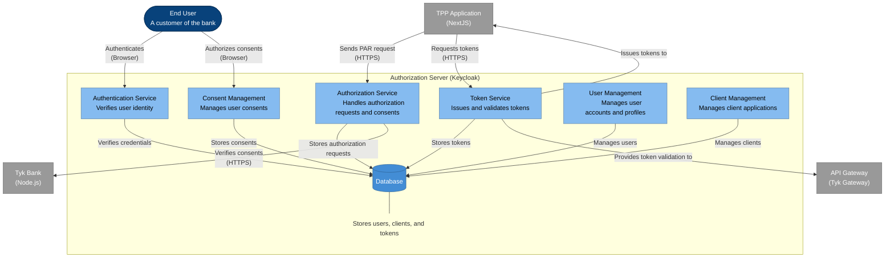

# Authorization Server - Container Diagram

This diagram shows the internal structure of the Authorization Server component in the Tyk FAPI Accelerator.

## Description

The Authorization Server container diagram shows the internal components of the Keycloak Authorization Server:

1. **Authentication Service**: Verifies user identity through various authentication methods. It handles user login and multi-factor authentication.

2. **Authorization Service**: Handles authorization requests and consents. Based on our analysis, it supports Pushed Authorization Requests (PAR) as required by FAPI 2.0.

3. **Token Service**: Issues and validates tokens, including access tokens, ID tokens, and refresh tokens. It implements OAuth 2.0 and OpenID Connect protocols.

4. **Consent Management**: Manages user consents for access to their data. It presents consent screens to users and records their decisions.

5. **User Management**: Manages user accounts and profiles, including registration, profile updates, and password resets.

6. **Client Management**: Manages client applications (like the TPP) that integrate with the system, including client registration and configuration.

7. **Database**: Stores users, clients, tokens, and other authorization-related data.

The key relationships shown in the diagram include:

- The TPP Application sends Pushed Authorization Requests (PAR) to the Authorization Service
- The TPP Application requests tokens from the Token Service
- The End User authenticates with the Authentication Service
- The End User authorizes consents through the Consent Management component
- All components interact with the Database to store and retrieve data
- The Authorization Service verifies consents with the Tyk Bank
- The Token Service issues tokens to the TPP Application
- The Token Service provides token validation to the API Gateway

This architecture implements the FAPI 2.0 security profile, which includes:

- OAuth 2.0 with Pushed Authorization Requests (PAR)
- JWT-based tokens
- PKCE (Proof Key for Code Exchange)
- Strict redirect URI validation

The Authorization Server is a critical component for security in the system, ensuring that:

1. Users are properly authenticated
2. Users explicitly consent to data access
3. TPPs can only access data they are authorized to access
4. Tokens are securely issued and validated