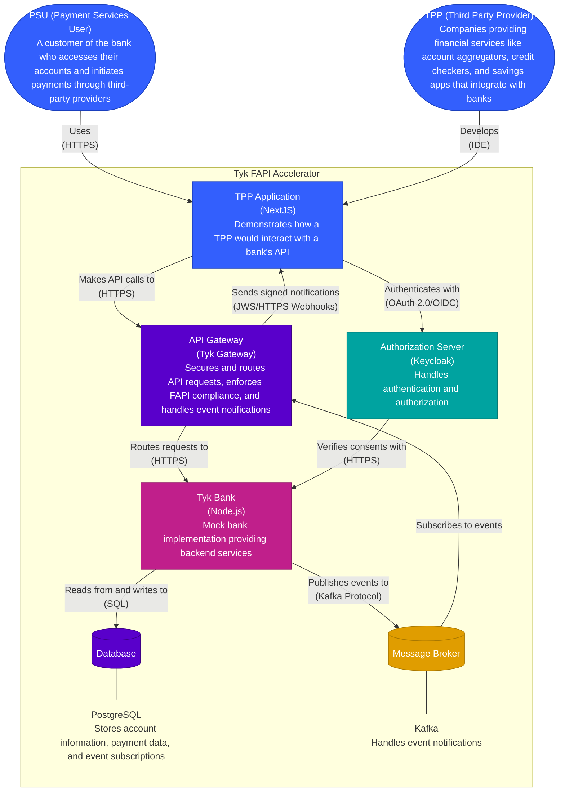

# Tyk FAPI Accelerator - Container Diagram

This diagram shows the major containers (applications, data stores) that make up the Tyk FAPI Accelerator system.

## Description

The container diagram shows the major components of the Tyk FAPI Accelerator:

1. **TPP Application**: A NextJS application that demonstrates how a Third Party Provider (TPP) would interact with a bank's API. It provides a user interface for Payment Service Users (PSUs) to view account information, initiate payments, and test authorization flows.

2. **API Gateway**: The Tyk Gateway that secures and routes requests to the appropriate backend services while enforcing FAPI compliance. It validates DPoP tokens, protects against replay attacks, validates JWTs, ensures routing only to endpoints defined in the specs, and handles event notifications. It subscribes to Kafka events and dispatches those events to subscribed TPPs, signing the webhook requests using JWS (JSON Web Signature) to ensure authenticity.

3. **Authorization Server**: A Keycloak instance that handles authentication and authorization. It supports OAuth 2.0 and OpenID Connect protocols, and is responsible for issuing tokens and managing consent.

4. **Tyk Bank**: A Node.js mock bank implementation that provides the backend services. It includes modules for account information, payment initiation, and event subscriptions.

5. **Database**: A PostgreSQL database that stores account information, payment data, and event subscriptions.

6. **Message Broker**: A Kafka instance that handles event notifications, allowing the bank to notify TPPs of events like payment status changes.

The diagram also shows the key relationships between these components, including:

- The TPP Application makes API calls to the API Gateway
- The TPP Application authenticates with the Authorization Server
- The API Gateway routes requests to the Tyk Bank
- The Authorization Server verifies consents with the Tyk Bank
- The Tyk Bank reads from and writes to the Database
- The Tyk Bank publishes events to the Message Broker

### Event Notification Flow

The event notification flow is handled as follows:

1. The Tyk Bank publishes events to Kafka when significant events occur (e.g., payment status changes)
2. The Event Dispatcher API in the API Gateway consumes these Kafka events
3. The Event Dispatcher identifies which TPPs should receive the notifications based on their subscriptions via DB lookup
4. The Event Dispatcher constructs the webhook payload and forwards it to the Event Notification Forwarder API
5. The Event Notification Forwarder API signs the webhook payload using JSON Web Signature (JWS)
6. The signed notifications are sent to the appropriate TPPs' callback URLs
7. TPPs can verify the authenticity of the webhooks using the JWS signature, ensuring they haven't been tampered with