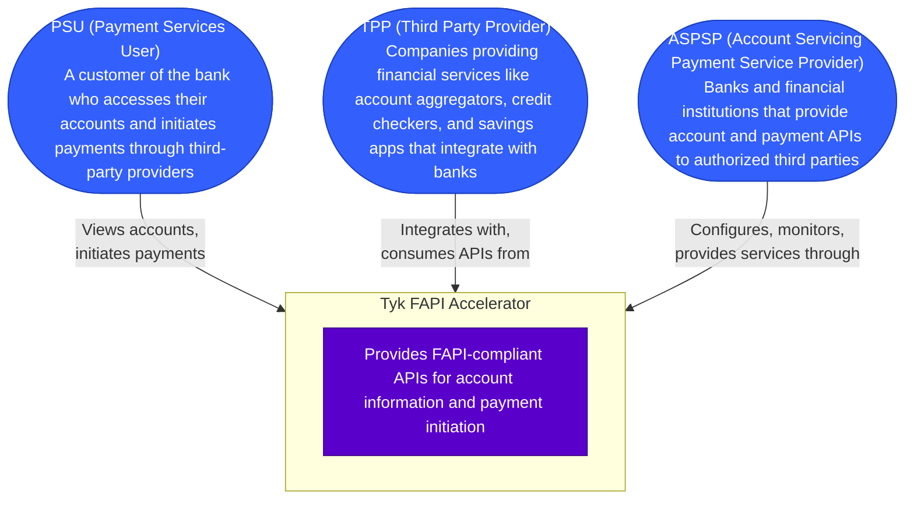

# Tyk FAPI Accelerator - Context Diagram

This diagram shows the Tyk FAPI Accelerator system in its environment, including users and key actors.

## Description

The context diagram shows the Tyk FAPI Accelerator system and its interactions with:

1. **PSU (Payment Services User)**: Customers of banks who access their accounts and initiate payments through third-party providers
2. **TPP (Third Party Provider)**: Companies that provide financial services such as account aggregation, credit checking, and savings applications by integrating with banks' APIs
3. **ASPSP (Account Servicing Payment Service Provider)**: Banks and financial institutions that expose their account and payment services through APIs to authorized third parties

This high-level view establishes the boundaries of the system and its key interactions.