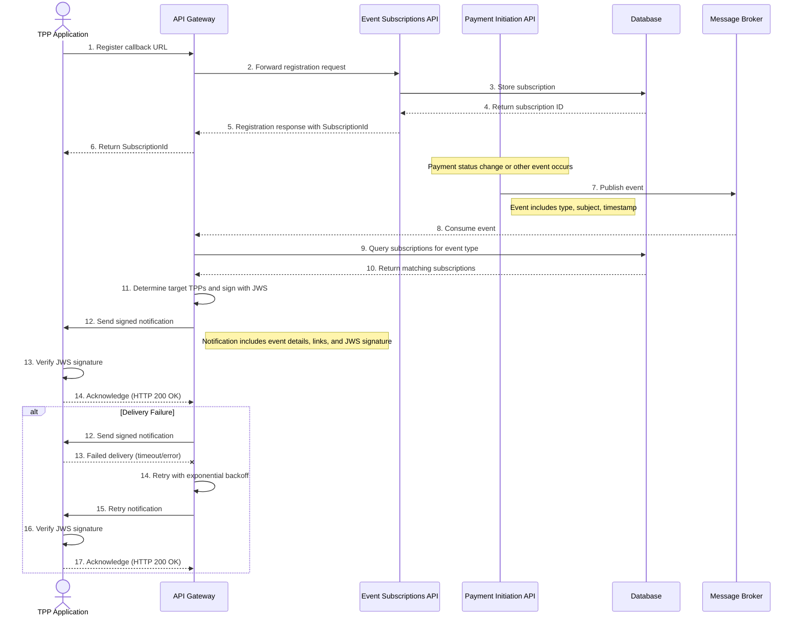

# Event Notification Flow - Sequence Diagram

This diagram shows the sequence of interactions between components during the event notification process in the Tyk FAPI Accelerator.

## Description

The event notification sequence diagram shows the interactions between components during the event notification process:

### Subscription Registration
1. The TPP Application registers a callback URL with the API Gateway
2. The API Gateway forwards the registration request to the Event Subscriptions API
3. The Event Subscriptions API stores the subscription in the Database
4. The Database returns the subscription ID
5. The Event Subscriptions API returns the registration response with the SubscriptionId
6. The API Gateway forwards the response to the TPP

### Event Generation
7. When a payment status change or other event occurs in the Payment Initiation API, it publishes an event to Kafka
   - The event includes the event type, subject, and timestamp

### Event Processing
8. The API Gateway consumes the event from Kafka
9. The API Gateway queries the Database for subscriptions matching the event type
10. The Database returns the matching subscriptions
11. The API Gateway determines which TPPs should receive the notifications and signs them with JWS

### Notification Delivery
12. The API Gateway sends a signed notification to the TPP
    - The notification includes event details, links to relevant resources, and a JWS signature
13. The TPP verifies the JWS signature to ensure the notification is authentic and hasn't been tampered with
14. The TPP acknowledges the notification with an HTTP 200 OK response

### Error Handling (Alternative Flow)
In case of delivery failure:
12. The API Gateway sends a signed notification to the TPP
13. The delivery fails due to a timeout or error
14. The API Gateway implements a retry mechanism with exponential backoff
15. The API Gateway retries the notification
16. The TPP verifies the JWS signature
17. The TPP acknowledges the notification with an HTTP 200 OK response

This sequence diagram illustrates the complete event notification flow, from subscription registration to notification delivery, including the security measures (JWS signing) and error handling with retries.

### Supported Event Types

The following event types are supported:
- `payment-consent-created`: When a TPP creates a new payment consent
- `payment-consent-authorised`: When a PSU authorizes a payment consent
- `payment-consent-rejected`: When a PSU rejects a payment consent
- `payment-created`: When a TPP creates a new payment
- `payment-completed`: When a payment is successfully processed
- `payment-failed`: When a payment processing fails
- `funds-confirmation-completed`: When a funds confirmation check is performed

### Security Benefits

The use of JWS (JSON Web Signature) for signing notifications provides several security benefits:
1. **Authenticity**: TPPs can verify that the notification came from the legitimate API Gateway
2. **Integrity**: TPPs can verify that the notification content hasn't been tampered with during transmission
3. **Non-repudiation**: The API Gateway cannot deny having sent the notification
4. **Protection against replay attacks**: The JWS can include timestamps and nonces to prevent replay attacks