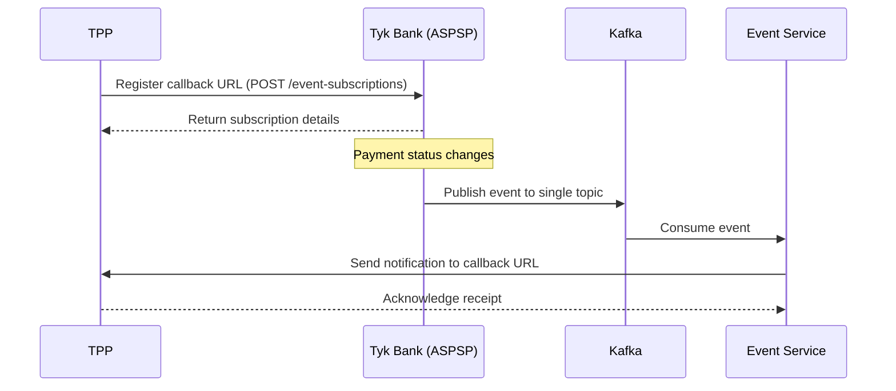

# Event Notifications in Tyk Bank Mock

This document describes the event notifications feature in the Tyk Bank mock implementation, including how to enable it, how to use it, and the architecture behind it.

## Overview

The event notifications feature allows TPPs (Third Party Providers) to register callback URLs with the bank and receive notifications when certain events occur, such as payment status changes or consent authorizations.

The implementation follows the UK Open Banking Event Notifications and Events APIs specifications:
- Events API: Allows TPPs to register and manage callback URLs
- Event Notifications API: Allows the bank to push notifications to TPPs

## Architecture

The event notifications system uses Kafka as a message broker to decouple the event generation from event delivery:



1. TPPs register their callback URLs with the bank using the Events API
2. When events occur in the bank (e.g., payment status changes), they are published to Kafka
3. The Event Service consumes events from Kafka and delivers them to the registered TPPs
4. TPPs receive and acknowledge the notifications

## Enabling Event Notifications

Event notifications are disabled by default. To enable them:

1. Set the `ENABLE_EVENTS` environment variable to `true` in the Docker Compose file:

```yaml
environment:
  - ENABLE_EVENTS=true
  - KAFKA_BROKER=kafka:9092
```

2. Start the services with Docker Compose:

```bash
docker-compose up
```

## Event Types

The following event types are supported:

| Event Type | Description | Trigger |
|------------|-------------|---------|
| `payment-consent-created` | A new payment consent is created | When a TPP creates a new payment consent |
| `payment-consent-authorised` | A payment consent is authorized | When a PSU authorizes a payment consent |
| `payment-consent-rejected` | A payment consent is rejected | When a PSU rejects a payment consent |
| `payment-created` | A new payment is created | When a TPP creates a new payment |
| `payment-completed` | A payment is completed | When a payment is successfully processed |
| `payment-failed` | A payment fails | When a payment processing fails |
| `funds-confirmation-completed` | A funds confirmation check is completed | When a funds confirmation check is performed |

## API Endpoints

### Events API (Bank-side)

#### Register a Callback URL

```
POST /event-subscriptions
```

Request body:
```json
{
  "Data": {
    "CallbackUrl": "https://tpp.example.com/event-notifications",
    "Version": "1.0",
    "EventTypes": [
      "payment-completed",
      "payment-failed"
    ]
  }
}
```

Response:
```json
{
  "Data": {
    "EventSubscriptionId": "esub-12345678",
    "CallbackUrl": "https://tpp.example.com/event-notifications",
    "Version": "1.0",
    "EventTypes": [
      "payment-completed",
      "payment-failed"
    ]
  },
  "Links": {
    "Self": "https://bank.example.com/event-subscriptions/esub-12345678"
  },
  "Meta": {
    "TotalPages": 1
  }
}
```

#### Get All Subscriptions

```
GET /event-subscriptions
```

#### Get Subscription by ID

```
GET /event-subscriptions/{EventSubscriptionId}
```

#### Update Subscription

```
PUT /event-subscriptions/{EventSubscriptionId}
```

#### Delete Subscription

```
DELETE /event-subscriptions/{EventSubscriptionId}
```

### Event Notifications API (TPP-side)

#### Receive Notification

```
POST /event-notifications
```

The bank will send notifications to this endpoint in the following format:

```json
{
  "iss": "https://tyk-bank.example.com",
  "iat": 1619712000,
  "jti": "evt-12345678",
  "aud": "https://tpp.example.com",
  "sub": "urn:uk:org:openbanking:payment:p-12345678",
  "txn": "txn-12345678",
  "toe": 1619712000,
  "events": {
    "urn:uk:org:openbanking:events:resource-update": {
      "subject": {
        "subject_type": "payment",
        "http://openbanking.org.uk/rid": "p-12345678",
        "http://openbanking.org.uk/rty": "payment",
        "http://openbanking.org.uk/rlk": [
          {
            "version": "1.0",
            "link": "https://tyk-bank.example.com/domestic-payments/p-12345678"
          }
        ]
      }
    }
  }
}
```

## TPP Integration

TPPs can integrate with the event notifications system by:

1. Registering a callback URL with the bank
2. Implementing an endpoint to receive notifications
3. Processing the received notifications

Example code for registering a callback URL:

```typescript
import eventsApi from '@/lib/api/eventsApi';

// Register a callback URL
const response = await eventsApi.registerEventSubscription(
  'https://tpp.example.com/api/event-notifications',
  [
    EventType.PAYMENT_COMPLETED,
    EventType.PAYMENT_FAILED
  ]
);
```

## Security Considerations

In a production environment, the following security measures should be implemented:

1. **Authentication and Authorization**
   - OAuth 2.0 for authenticating TPPs
   - Scope validation for event subscription management

2. **Message Integrity and Authenticity**
   - JWS signing of event notifications
   - Signature validation on the receiving end

3. **Transport Security**
   - TLS 1.2+ for all communications

4. **Callback URL Validation**
   - Validation of callback URLs before accepting them

## Troubleshooting

If you encounter issues with event notifications:

1. Check if events are enabled (`ENABLE_EVENTS=true`)
2. Verify that Kafka is running and accessible
3. Check the logs for error messages
4. Ensure the callback URL is accessible from the bank

## References

- [UK Open Banking Event Notifications API Specification](https://openbankinguk.github.io/read-write-api-site3/v3.1.10/profiles/event-notification-api-profile.html)
- [UK Open Banking Events API Specification](https://openbankinguk.github.io/read-write-api-site3/v3.1.10/profiles/event-subscription-api-profile.html)