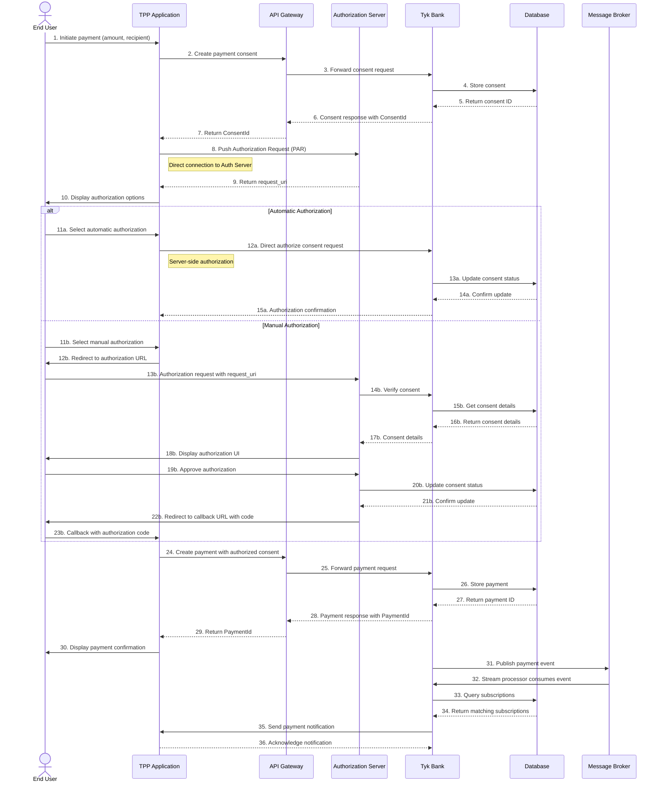

# Payment Flow - Sequence Diagram

This diagram shows the sequence of interactions between components during a payment flow in the Tyk FAPI Accelerator.

## Description

The payment flow sequence diagram shows the interactions between components during a payment process:

### Payment Initiation and Consent
1. The End User initiates a payment in the TPP Application
2. The TPP creates a payment consent through the API Gateway
3. The API Gateway forwards the request to the Tyk Bank
4. The Tyk Bank stores the consent in the Database
5. The Database returns the consent ID
6. The Tyk Bank returns the consent response with the ConsentId
7. The API Gateway forwards the response to the TPP

### Authorization
8. The TPP sends a Pushed Authorization Request (PAR) directly to the Authorization Server
9. The Authorization Server returns a request_uri
10. The TPP displays authorization options to the user

### Automatic Authorization Flow
11a. The user selects automatic authorization
12a. The TPP sends a direct authorize consent request to the Tyk Bank
13a-14a. The Tyk Bank updates the consent status in the Database
15a. The Tyk Bank returns an authorization confirmation to the TPP

### Manual Authorization Flow
11b. The user selects manual authorization
12b. The TPP redirects the user to the authorization URL
13b. The user sends an authorization request with the request_uri to the Authorization Server
14b. The Authorization Server verifies the consent with the Tyk Bank
15b-16b. The Tyk Bank gets the consent details from the Database
17b. The Tyk Bank returns the consent details to the Authorization Server
18b. The Authorization Server displays an authorization UI to the user
19b. The user approves the authorization
20b-21b. The Authorization Server updates the consent status in the Database
22b. The Authorization Server redirects the user to the callback URL with an authorization code
23b. The user's browser makes a callback to the TPP with the authorization code

### Payment Creation and Confirmation
24. The TPP creates a payment with the authorized consent through the API Gateway
25. The API Gateway forwards the payment request to the Tyk Bank
26-27. The Tyk Bank stores the payment in the Database
28. The Tyk Bank returns a payment response with the PaymentId
29. The API Gateway forwards the response to the TPP
30. The TPP displays a payment confirmation to the user

### Event Notification
31. The Tyk Bank publishes a payment event to Kafka
32. The Stream Processor in the Tyk Bank consumes the event from Kafka
33-34. The Stream Processor queries the Database for matching subscriptions
35. The Stream Processor sends a payment notification to the TPP
36. The TPP acknowledges the notification

This sequence diagram illustrates both the automatic and manual authorization flows, as well as the event notification process that occurs after a payment is created.