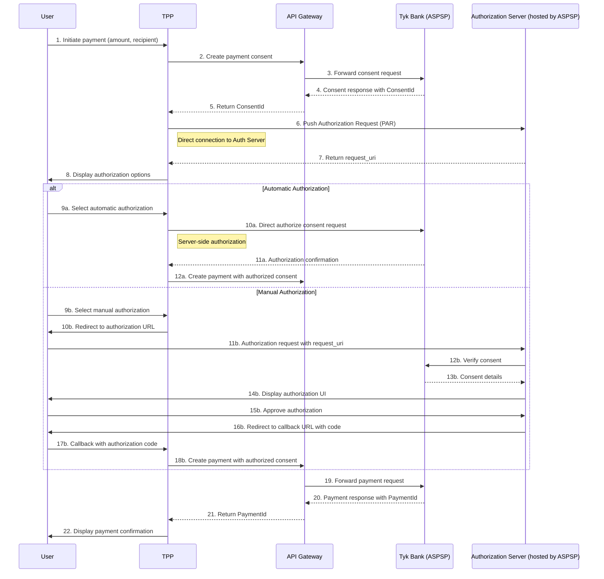

# Payment Flow

This document provides a detailed explanation of the payment flow in the Tyk FAPI Accelerator, focusing on how the TPP initiates and completes a payment using the FAPI 2.0 security profile with Pushed Authorization Requests (PAR).

## Overview

The payment flow in the TPP application follows the FAPI 2.0 security profile with Pushed Authorization Requests (PAR). This flow involves multiple steps and interactions between the TPP, API Gateway, Authorization Server, and the ASPSP (Tyk Bank).

## Payment Flow Diagram



## Detailed Steps

### 1. Payment Initiation

The flow begins when a user initiates a payment in the TPP application. The user fills out a payment form with:

- Amount and currency
- Recipient account details
- Payment reference
- Other payment details

The TPP collects this information and prepares to create a payment consent.

### 2-5. Payment Consent Creation

The TPP sends a request to create a payment consent through the API Gateway:

```typescript
// Client-side code
const createPaymentConsent = async (consentRequest) => {
  try {
    const response = await paymentsApi.createPaymentConsent(consentRequest);
    return response;
  } catch (error) {
    console.error('Error creating payment consent:', error);
    throw error;
  }
};

// Server-side API route
export async function POST(request: NextRequest) {
  try {
    const body = await request.json();
    const url = `${API_GATEWAY_URLS.PAYMENT_INITIATION}/domestic-payment-consents`;
    
    return makeApiGatewayRequest(
      url,
      {
        method: 'POST',
        headers: getApiGatewayHeaders(request),
        body: JSON.stringify(body),
      },
      'Error creating payment consent'
    );
  } catch (error) {
    console.error('Server-side API route: Error parsing request body:', error);
    return Response.json(
      { error: 'Failed to parse request body' },
      { status: 400 }
    );
  }
}
```

The API Gateway forwards the request to the Tyk Bank, which creates a consent record and returns a ConsentId. The API Gateway then forwards the response back to the TPP.

### 6-7. Pushed Authorization Request (PAR)

The TPP sends a PAR request directly to the Authorization Server:

```typescript
// Client-side code
const pushAuthorizationRequest = async (params) => {
  try {
    const response = await paymentsApi.pushAuthorizationRequest(params);
    return response;
  } catch (error) {
    console.error('Error pushing authorization request:', error);
    throw error;
  }
};

// Server-side API route
export async function POST(request: NextRequest) {
  try {
    const body = await request.json();
    const url = `${AUTHORIZATION_SERVER_URL}/as/par`;
    
    // Try direct connection to authorization server first
    let directResult = await tryPARRequest(url, body, request, 'direct');
    
    // If direct connection was successful, return the result
    if (directResult.success) {
      return directResult.response;
    }
    
    // If direct connection failed, try using the API Gateway
    console.log(`Direct connection to authorization server failed: ${directResult.error}`);
    console.log('Falling back to API Gateway for PAR request');
    
    const apiGatewayUrl = `${API_GATEWAY_URLS.PAYMENT_INITIATION}/as/par`;
    const gatewayResult = await tryPARRequest(apiGatewayUrl, body, request, 'gateway');
    
    if (gatewayResult.success) {
      return gatewayResult.response;
    }
    
    // If both failed, return an error
    return NextResponse.json(
      {
        error: 'Both direct connection and API Gateway failed',
        message: 'Unable to push authorization request through either direct connection or API Gateway.',
        directError: directResult.error,
        gatewayError: gatewayResult.error
      },
      { status: 503 }
    );
  } catch (error) {
    console.error('Server-side API route: Error parsing request body:', error);
    return Response.json(
      { error: 'Failed to parse request body' },
      { status: 400 }
    );
  }
}
```

The Authorization Server processes the PAR request and returns a request_uri that will be used for authorization.

### 8. Authorization Options

The TPP displays authorization options to the user:

```typescript
export function AuthorizationOptions({ consent, requestUri, onAuthorized }) {
  const router = useRouter();
  const authorizeConsentMutation = useAuthorizePaymentConsent();
  
  const handleAutomaticAuthorization = async () => {
    try {
      await authorizeConsentMutation.mutateAsync(consent.Data.ConsentId);
      onAuthorized();
    } catch (error) {
      console.error('Error authorizing consent:', error);
    }
  };
  
  const handleManualAuthorization = () => {
    const consentId = consent.Data.ConsentId;
    const initiationData = JSON.stringify(consent.Data.Initiation);
    
    localStorage.setItem('currentConsentId', consentId);
    localStorage.setItem('currentInitiationData', initiationData);
    
    let authorizationUrl = paymentsApi.getAuthorizationUrl(requestUri);
    
    if (authorizationUrl.includes('?')) {
      authorizationUrl += `&tpp_consent_id=${encodeURIComponent(consentId)}`;
    } else {
      authorizationUrl += `?tpp_consent_id=${encodeURIComponent(consentId)}`;
    }
    
    localStorage.setItem('redirectionAttempted', 'true');
    window.location.href = authorizationUrl;
  };
  
  return (
    <Card>
      <CardHeader>
        <CardTitle>Authorize Payment</CardTitle>
        <CardDescription>Please authorize this payment to proceed</CardDescription>
      </CardHeader>
      <CardContent>
        {/* Payment details */}
        <div>
          <Button onClick={handleAutomaticAuthorization}>
            Authorize Automatically
          </Button>
          <Button onClick={handleManualAuthorization}>
            Authorize Manually
          </Button>
        </div>
      </CardContent>
    </Card>
  );
}
```

### 9a-12a. Automatic Authorization Flow

If the user selects automatic authorization, the TPP directly authorizes the consent without user interaction with the Authorization Server:

```typescript
// Client-side code
const authorizePaymentConsent = async (consentId) => {
  try {
    const response = await paymentsApi.authorizePaymentConsent(consentId);
    return response;
  } catch (error) {
    console.error('Error authorizing payment consent:', error);
    throw error;
  }
};

// Server-side API route
export async function PUT(
  request: NextRequest,
  { params }: { params: { consentId: string } }
) {
  try {
    const consentId = params?.consentId;
    
    if (!consentId) {
      console.error('Missing consentId parameter');
      return NextResponse.json(
        { error: 'Missing consentId parameter' },
        { status: 400 }
      );
    }
    
    console.log(`Server-side API route: Authorizing payment consent ${consentId} via Authorization Server`);
    
    const authServerUrl = `${AUTHORIZATION_SERVER_URL}/domestic-payment-consents/${consentId}/authorize`;
    console.log(`Making direct request to Authorization Server: ${authServerUrl}`);
    
    const response = await fetch(authServerUrl, {
      method: 'PUT',
      headers: getApiGatewayHeaders(request),
    });
    
    // Handle the response
    if (!response.ok) {
      console.error(`Error authorizing payment consent ${consentId}: ${response.status} ${response.statusText}`);
      
      let errorData;
      try {
        errorData = await response.json();
        console.error('Error details:', errorData);
      } catch (e) {
        try {
          errorData = await response.text();
        } catch (e2) {
          errorData = 'Unknown error';
        }
      }
      
      return NextResponse.json(
        { 
          error: `Failed to authorize payment consent: ${response.statusText}`,
          details: errorData
        },
        { status: response.status }
      );
    }
    
    const data = await response.json();
    console.log(`Server-side API route: Successfully authorized payment consent ${consentId}`);
    return NextResponse.json(data);
  } catch (error) {
    console.error(`Server-side API route: Error authorizing payment consent:`, error);
    
    if (error instanceof TypeError && error.message.includes('fetch')) {
      return NextResponse.json(
        { 
          error: 'authorization_server_unavailable',
          error_description: 'The Authorization Server is not available. Please ensure it is running.',
          details: error.message
        },
        { status: 503 }
      );
    }
    
    return NextResponse.json(
      { error: 'Unexpected error authorizing payment consent' },
      { status: 500 }
    );
  }
}
```

After the consent is authorized, the TPP creates the payment using the authorized consent.

### 9b-18b. Manual Authorization Flow

If the user selects manual authorization, the TPP redirects the user to the Authorization Server with the request_uri:

```typescript
// In the AuthorizationOptions component
const handleManualAuthorization = () => {
  const consentId = consent.Data.ConsentId;
  const initiationData = JSON.stringify(consent.Data.Initiation);
  
  localStorage.setItem('currentConsentId', consentId);
  localStorage.setItem('currentInitiationData', initiationData);
  
  let authorizationUrl = paymentsApi.getAuthorizationUrl(requestUri);
  
  if (authorizationUrl.includes('?')) {
    authorizationUrl += `&tpp_consent_id=${encodeURIComponent(consentId)}`;
  } else {
    authorizationUrl += `?tpp_consent_id=${encodeURIComponent(consentId)}`;
  }
  
  localStorage.setItem('redirectionAttempted', 'true');
  window.location.href = authorizationUrl;
};
```

The Authorization Server displays an authorization UI to the user, who approves the authorization. The Authorization Server then redirects back to the TPP with an authorization code.

The TPP handles the callback in the callback page:

```typescript
// In the callback page
useEffect(() => {
  const handleCallback = async () => {
    // Get the authorization code and state from the URL
    const code = searchParams.get('code');
    const state = searchParams.get('state');
    
    if (!code) {
      setError('No authorization code found in the URL');
      setStatus('error');
      return;
    }
    
    // Get the consent ID and initiation data from localStorage
    let consentId = null;
    let initiationData = null;
    
    const urlConsentId = searchParams.get('tpp_consent_id');
    const localStorageConsentId = localStorage.getItem('currentConsentId');
    const localStorageInitiationData = localStorage.getItem('currentInitiationData');
    
    if (urlConsentId) {
      consentId = urlConsentId;
    } else if (localStorageConsentId) {
      consentId = localStorageConsentId;
    } else {
      setError('Missing consent ID. Please try again.');
      setStatus('error');
      return;
    }
    
    if (localStorageInitiationData) {
      try {
        initiationData = JSON.parse(localStorageInitiationData);
      } catch (err) {
        console.error('Error parsing initiation data:', err);
        // Use fallback initiation data
      }
    }
    
    // Create the payment
    try {
      const paymentResponse = await createPaymentMutation.mutateAsync({
        Data: {
          ConsentId: consentId,
          Initiation: initiationData
        },
        Risk: { /* ... */ }
      });
      
      setPaymentId(paymentResponse.Data.DomesticPaymentId);
      setStatus('success');
      
      // Clear localStorage
      localStorage.removeItem('currentConsentId');
      localStorage.removeItem('currentInitiationData');
      localStorage.removeItem('redirectionAttempted');
    } catch (err) {
      setError(err instanceof Error ? err.message : 'Unknown error');
      setStatus('error');
    }
  };
  
  handleCallback();
}, [searchParams]);
```

### 19-22. Payment Creation and Confirmation

After the consent is authorized (either automatically or manually), the TPP creates the payment using the authorized consent:

```typescript
// Client-side code
const createPayment = async (paymentRequest) => {
  try {
    const response = await paymentsApi.createPayment(paymentRequest);
    return response;
  } catch (error) {
    console.error('Error creating payment:', error);
    throw error;
  }
};

// Server-side API route
export async function POST(request: NextRequest) {
  try {
    const body = await request.json();
    const url = `${API_GATEWAY_URLS.PAYMENT_INITIATION}/domestic-payments`;
    
    return makeApiGatewayRequest(
      url,
      {
        method: 'POST',
        headers: getApiGatewayHeaders(request),
        body: JSON.stringify(body),
      },
      'Error creating payment'
    );
  } catch (error) {
    console.error('Server-side API route: Error parsing request body:', error);
    return Response.json(
      { error: 'Failed to parse request body' },
      { status: 400 }
    );
  }
}
```

The API Gateway forwards the request to the Tyk Bank, which creates the payment and returns a PaymentId. The API Gateway then forwards the response back to the TPP.

Finally, the TPP displays a payment confirmation to the user:

```typescript
// In the callback page
if (status === 'success') {
  return (
    <div className="container max-w-md mx-auto p-4">
      <Card>
        <CardHeader>
          <CardTitle className="text-green-600">Payment Successful</CardTitle>
        </CardHeader>
        <CardContent className="space-y-4">
          <div className="p-4 bg-green-50 dark:bg-green-900/20 rounded-lg border border-green-200 dark:border-green-900">
            <p className="text-green-800 dark:text-green-300">
              Your payment has been successfully processed.
            </p>
            {paymentId && (
              <p className="text-sm text-green-600 dark:text-green-400 mt-2">
                Payment ID: {paymentId}
              </p>
            )}
          </div>
          
          <div className="flex justify-center">
            <Button onClick={() => router.push('/')}>
              Return to Dashboard
            </Button>
          </div>
        </CardContent>
      </Card>
    </div>
  );
}
```

## Error Handling

The payment flow includes comprehensive error handling at each step:

- Validation of user input
- Error handling for API requests
- Fallback mechanisms for handling connection issues
- Detailed error messages for users
- Logging for debugging

## Security Considerations

The payment flow implements the FAPI 2.0 security profile, which includes:

- OAuth 2.0 with Pushed Authorization Requests (PAR)
- TLS 1.2+ for all communications
- JWT-based tokens
- PKCE (Proof Key for Code Exchange)
- Strict redirect URI validation

## Testing the Payment Flow

To test the payment flow:

1. Start the Tyk Bank mock server
2. Start the TPP application
3. Navigate to the TPP application in a browser
4. Go to the Payments page
5. Fill out the payment form
6. Choose either automatic or manual authorization
7. Complete the payment flow
8. Verify the payment confirmation

See the [TPP README](../tpp/README.md) for detailed instructions on running the TPP application.