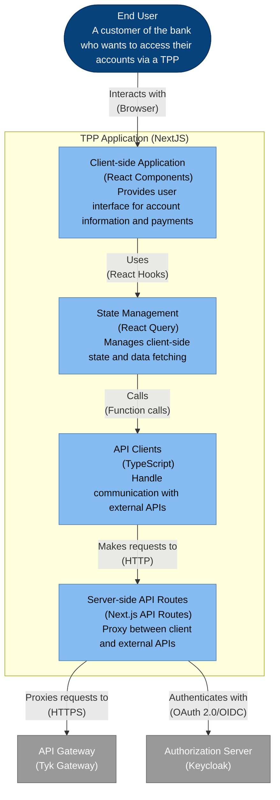

# TPP Application - Container Diagram

This diagram shows the internal structure of the TPP Application, which is one of the key components of the Tyk FAPI Accelerator.

## Description

The TPP Application container diagram shows the internal components of the TPP Application:

1. **Client-side Application**: React components that provide the user interface for viewing account information and initiating payments. This is what the end user interacts with directly in their browser.

2. **Server-side API Routes**: Next.js API routes that act as a proxy between the client-side application and external APIs. These routes handle authentication, error handling, and request/response transformation.

3. **API Clients**: TypeScript modules that handle communication with external APIs. They provide a clean interface for the client-side application to interact with the backend services.

4. **State Management**: React Query hooks that manage client-side state and data fetching. They provide caching, refetching, and error handling capabilities.

The diagram also shows the key relationships between these components:

- The End User interacts with the Client-side Application through their browser
- The Client-side Application uses State Management through React hooks
- State Management calls API Clients to fetch data
- API Clients make requests to Server-side API Routes
- Server-side API Routes proxy requests to the API Gateway
- Server-side API Routes authenticate with the Authorization Server

This architecture provides several benefits:

- Separation of concerns between UI, state management, and API communication
- Server-side proxying for security and error handling
- Type safety with TypeScript
- Efficient state management with React Query