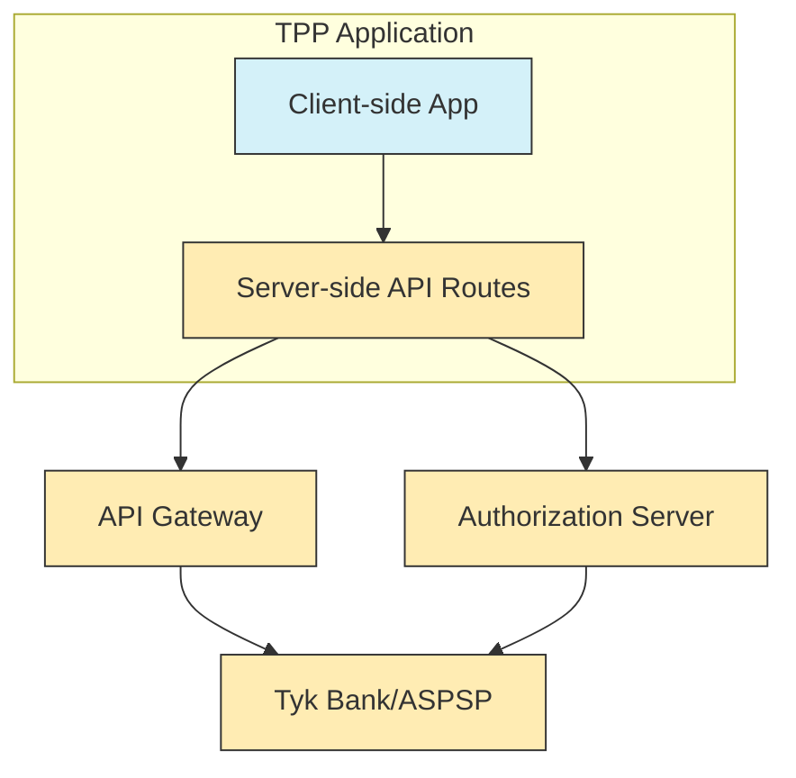

# TPP Integration Guide

This document provides detailed information about how the Third-Party Provider (TPP) integrates with the API Gateway and Authorization Server in the Tyk FAPI Accelerator.

## Overview

The TPP is a NextJS application that demonstrates how a third-party provider would interact with a bank's API using the Financial-grade API (FAPI) security profile. It integrates with:

- **API Gateway**: For account information and payment operations
- **Authorization Server**: For authorization flows

## Integration Architecture



## Client-Side and Server-Side Integration

The TPP uses a combination of client-side and server-side integration:

### Client-Side Integration

The client-side application uses React hooks and API client functions to communicate with the server-side API routes. This approach provides:

- Better user experience with client-side state management
- Separation of concerns between UI and API integration
- Type safety with TypeScript interfaces

Example client-side code:

```typescript
// Using a custom hook to fetch accounts
const { data: accounts, isLoading, error } = useAccounts();

// Using an API client function directly
const createPayment = async (paymentRequest) => {
  try {
    const response = await paymentsApi.createPayment(paymentRequest);
    return response;
  } catch (error) {
    console.error('Error creating payment:', error);
    throw error;
  }
};
```

### Server-Side Integration

The server-side API routes act as a proxy between the client-side application and the external APIs. This approach provides:

- Security by keeping sensitive information server-side
- Ability to add custom headers and authentication
- Centralized error handling
- Fallback mechanisms for handling connection issues

Example server-side code:

```typescript
// Server-side API route for creating a payment consent
export async function POST(request: NextRequest) {
  try {
    // Get the request body
    const body = await request.json();
    
    // Prepare the URL
    const url = `${API_GATEWAY_URLS.PAYMENT_INITIATION}/domestic-payment-consents`;
    
    // Make the request to the API Gateway
    return makeApiGatewayRequest(
      url,
      {
        method: 'POST',
        headers: getApiGatewayHeaders(request),
        body: JSON.stringify(body),
      },
      'Error creating payment consent'
    );
  } catch (error) {
    console.error('Server-side API route: Error parsing request body:', error);
    return Response.json(
      { error: 'Failed to parse request body' },
      { status: 400 }
    );
  }
}
```

## API Gateway Integration

The TPP integrates with the API Gateway for most operations, including:

- Account information retrieval
- Payment consent creation
- Payment creation
- Funds confirmation

### API Gateway Headers

The TPP adds the following headers to API Gateway requests:

```typescript
export function getApiGatewayHeaders(request: NextRequest): HeadersInit {
  return {
    'Content-Type': 'application/json',
    'Accept': 'application/json',
    'X-Forwarded-For': request.headers.get('x-forwarded-for') || '',
    'X-Forwarded-Host': request.headers.get('host') || '',
    'X-Forwarded-Proto': 'http',
    ...(request.headers.get('authorization') ? { 'Authorization': request.headers.get('authorization') || '' } : {})
  };
}
```

## Authorization Server Integration

The TPP integrates directly with the Authorization Server for authorization flows, including:

- Pushed Authorization Requests (PAR)
- Authorization redirects
- Callback handling

### Pushed Authorization Requests (PAR)

The TPP sends a PAR request to the Authorization Server to initiate the authorization flow:

```typescript
export const pushAuthorizationRequest = async (params: {
  clientId: string;
  responseType: string;
  scope: string;
  redirectUri: string;
  state: string;
  consentId?: string;
}): Promise<PushedAuthorizationResponse> => {
  try {
    const response = await axios.post<PushedAuthorizationResponse>(
      `${API_URL}/as/par`,
      params
    );
    return response.data;
  } catch (error) {
    console.error('Error pushing authorization request:', error);
    throw error;
  }
};
```

### Authorization Redirect

The TPP redirects the user to the Authorization Server for manual authorization:

```typescript
const handleManualAuthorization = () => {
  // Store consent data in localStorage
  localStorage.setItem('currentConsentId', consentId);
  localStorage.setItem('currentInitiationData', JSON.stringify(initiationData));
  
  // Get the authorization URL
  let authorizationUrl = paymentsApi.getAuthorizationUrl(requestUri);
  
  // Add consent ID to the URL
  authorizationUrl += `&tpp_consent_id=${encodeURIComponent(consentId)}`;
  
  // Redirect to the authorization URL
  window.location.href = authorizationUrl;
};
```

### Callback Handling

The TPP handles the callback from the Authorization Server after manual authorization:

```typescript
// In the callback page
useEffect(() => {
  const handleCallback = async () => {
    // Get the authorization code and state from the URL
    const code = searchParams.get('code');
    const state = searchParams.get('state');
    
    // Get the consent ID from localStorage
    const consentId = localStorage.getItem('currentConsentId');
    
    // Create the payment
    const paymentResponse = await createPaymentMutation.mutateAsync({
      Data: {
        ConsentId: consentId,
        Initiation: initiationData
      },
      Risk: { /* ... */ }
    });
    
    // Clear localStorage
    localStorage.removeItem('currentConsentId');
    localStorage.removeItem('currentInitiationData');
  };
  
  handleCallback();
}, [searchParams]);
```

## Fallback Mechanisms

The TPP implements fallback mechanisms to handle connection issues:

1. For authorization requests, it first tries to connect directly to the Authorization Server
2. If that fails, it falls back to using the API Gateway
3. If both fail, it displays an error message

Example fallback code:

```typescript
// Try direct connection to authorization server first
let directResult = await tryPARRequest(url, body, request, 'direct');

// If direct connection was successful, return the result
if (directResult.success) {
  return directResult.response;
}

// If direct connection failed, try using the API Gateway
console.log(`Direct connection to authorization server failed: ${directResult.error}`);
console.log('Falling back to API Gateway for PAR request');

// Construct the API Gateway URL
const apiGatewayUrl = `${API_GATEWAY_URLS.PAYMENT_INITIATION}/as/par`;

// Try the API Gateway
const gatewayResult = await tryPARRequest(apiGatewayUrl, body, request, 'gateway');

// If API Gateway was successful, return the result
if (gatewayResult.success) {
  return gatewayResult.response;
}

// If both failed, return an error
return NextResponse.json(
  {
    error: 'Both direct connection and API Gateway failed',
    message: 'Unable to push authorization request through either direct connection or API Gateway.',
    directError: directResult.error,
    gatewayError: gatewayResult.error
  },
  { status: 503 }
);
```

## Configuration

The TPP uses environment variables for configuration:

| Variable | Description | Default |
|----------|-------------|---------|
| NEXT_PUBLIC_ACCOUNT_API_URL | Client-side URL for account API | /api |
| NEXT_PUBLIC_PAYMENT_API_URL | Client-side URL for payment API | /api |
| ACCOUNT_INFORMATION_API_URL | Server-side URL for account API | http://localhost:8080/account-information |
| PAYMENT_INITIATION_API_URL | Server-side URL for payment API | http://localhost:8080/payment-initiation |
| AUTHORIZATION_SERVER_URL | URL for the authorization server | http://localhost:3002 |

These variables can be set in the `.env.local` file in the TPP directory.

## Error Handling

The TPP implements comprehensive error handling for API integration:

- Client-side error handling with React Query error states
- Server-side error handling with detailed error responses
- Fallback mechanisms for handling connection issues
- Logging for debugging

Example error handling code:

```typescript
try {
  const response = await fetch(url, options);
  
  if (!response.ok) {
    let errorData;
    try {
      errorData = await response.json();
    } catch (e) {
      try {
        errorData = await response.text();
      } catch (e2) {
        errorData = 'Unknown error';
      }
    }
    
    console.error(`Error: ${response.status} ${response.statusText}`, errorData);
    
    return NextResponse.json(
      { error: errorData || response.statusText },
      { status: response.status }
    );
  }
  
  const data = await response.json();
  return NextResponse.json(data);
} catch (error) {
  console.error('Error:', error);
  
  return NextResponse.json(
    { error: 'Failed to connect to API' },
    { status: 500 }
  );
}
```

## Testing the Integration

To test the TPP integration:

1. Start the Tyk Bank mock server
2. Start the TPP application
3. Navigate to the TPP application in a browser
4. Test account information retrieval and payment initiation
5. Test both automatic and manual authorization flows

See the [TPP README](../tpp/README.md) for detailed instructions on running the TPP application.