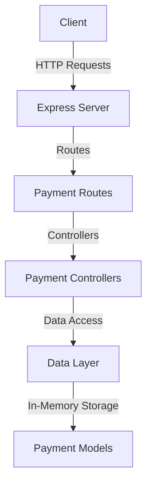

# Implementation Plan for Tyk-Bank Payment Initiation API Microservice

## Overview

The payment-initiation API microservice will implement the UK Open Banking Payment Initiation API specification, focusing on domestic payments. It will follow the same architectural pattern as the existing account-information API microservice, using Express.js with TypeScript.

## Architecture



## Directory Structure

The new microservice will follow the same structure as the account-information API:

```
tyk-bank/
└── src/
    └── uk/
        ├── account-information/ (existing)
        └── payment-initiation/ (new)
            ├── server.ts
            ├── controllers/
            │   ├── consents.ts
            │   └── payments.ts
            ├── data/
            │   ├── consents.ts
            │   └── payments.ts
            ├── models/
            │   ├── consent.ts
            │   └── payment.ts
            └── routes/
                ├── consents.ts
                └── payments.ts
```

## Implementation Steps

### 1. Create Basic Server Structure

1. Create a new server.ts file for the payment-initiation API
2. Set up Express with necessary middleware (cors, json parsing, logging)
3. Configure the server to run on a different port than the account-information API (e.g., 3002)
4. Add health check endpoint and error handling middleware

### 2. Define Data Models

1. Create model definitions for:
   - Payment consent (OBWriteDomesticConsent4)
   - Payment (OBWriteDomestic2)
   - Payment response (OBWriteDomesticResponse5)
   - Enums for payment status and other required types

### 3. Implement Data Layer

1. Create in-memory storage for payment consents and payments
2. Implement CRUD operations for payment consents and payments
3. Add sample data for testing

### 4. Create Controllers

1. Implement controllers for:
   - Creating payment consents
   - Retrieving payment consents
   - Creating payments
   - Retrieving payments
   - Retrieving payment details

### 5. Set Up Routes

1. Define routes for:
   - `/domestic-payment-consents` (POST, GET)
   - `/domestic-payment-consents/{ConsentId}` (GET)
   - `/domestic-payment-consents/{ConsentId}/funds-confirmation` (GET)
   - `/domestic-payments` (POST)
   - `/domestic-payments/{DomesticPaymentId}` (GET)
   - `/domestic-payments/{DomesticPaymentId}/payment-details` (GET)

### 6. Update Package.json

1. Add new scripts for:
   - Building the payment-initiation API
   - Running the payment-initiation API in development mode
   - Running both APIs simultaneously

### 7. Testing

1. Test all endpoints using tools like Postman or curl
2. Verify responses match the OpenAPI specification

## Detailed Component Specifications

### Models

#### Payment Consent Model

```typescript
// Key elements of the consent model
export enum ConsentStatus {
  AUTHORISED = 'Authorised',
  AWAITING_AUTHORISATION = 'AwaitingAuthorisation',
  CONSUMED = 'Consumed',
  REJECTED = 'Rejected',
  REVOKED = 'Revoked',
  EXPIRED = 'Expired'
}

export interface DomesticPaymentConsent {
  ConsentId: string;
  CreationDateTime: string;
  Status: ConsentStatus;
  StatusUpdateDateTime: string;
  Initiation: {
    InstructionIdentification: string;
    EndToEndIdentification: string;
    InstructedAmount: {
      Amount: string;
      Currency: string;
    };
    CreditorAccount: {
      SchemeName: string;
      Identification: string;
      Name: string;
      SecondaryIdentification?: string;
    };
    // Other fields as per spec
  };
  // Other fields as per spec
}
```

#### Payment Model

```typescript
// Key elements of the payment model
export enum PaymentStatus {
  PENDING = 'Pending',
  ACCEPTED_SETTLEMENT_IN_PROCESS = 'AcceptedSettlementInProcess',
  ACCEPTED_SETTLEMENT_COMPLETED = 'AcceptedSettlementCompleted',
  REJECTED = 'Rejected',
  // Other statuses as per spec
}

export interface DomesticPayment {
  DomesticPaymentId: string;
  ConsentId: string;
  CreationDateTime: string;
  Status: PaymentStatus;
  StatusUpdateDateTime: string;
  Initiation: {
    // Same structure as in consent
  };
  // Other fields as per spec
}
```

### Data Layer

The data layer will use in-memory arrays to store payment consents and payments, similar to the account-information API:

```typescript
// Sample implementation for consents data layer
export const paymentConsents: DomesticPaymentConsent[] = [
  // Sample data
];

export const createPaymentConsent = (consentData: any): DomesticPaymentConsent => {
  // Implementation
};

export const getPaymentConsentById = (consentId: string): DomesticPaymentConsent | undefined => {
  // Implementation
};

// Similar functions for payments
```

### Controllers

Controllers will handle the business logic for each endpoint:

```typescript
// Sample controller for creating payment consent
export const createDomesticPaymentConsent = (req: Request, res: Response) => {
  try {
    // Validate request
    // Create consent
    // Return response
  } catch (error) {
    // Handle error
  }
};

// Similar controllers for other endpoints
```

### Routes

Routes will map HTTP endpoints to controllers:

```typescript
// Sample routes for payment consents
const router = Router();

router.post('/', createDomesticPaymentConsent);
router.get('/:consentId', getDomesticPaymentConsent);

export default router;
```

## Integration with Existing Code

The new payment-initiation API will be a separate microservice running alongside the existing account-information API. We'll need to:

1. Create a new server.ts file for the payment-initiation API
2. Update package.json to include scripts for running both services
3. Consider updating the Docker configuration to support both services

## Timeline Estimate

1. Setting up project structure: 1 hour
2. Implementing models and data layer: 3 hours
3. Implementing controllers and routes: 4 hours
4. Testing and debugging: 2 hours
5. Documentation: 1 hour

Total estimated time: ~11 hours of development work