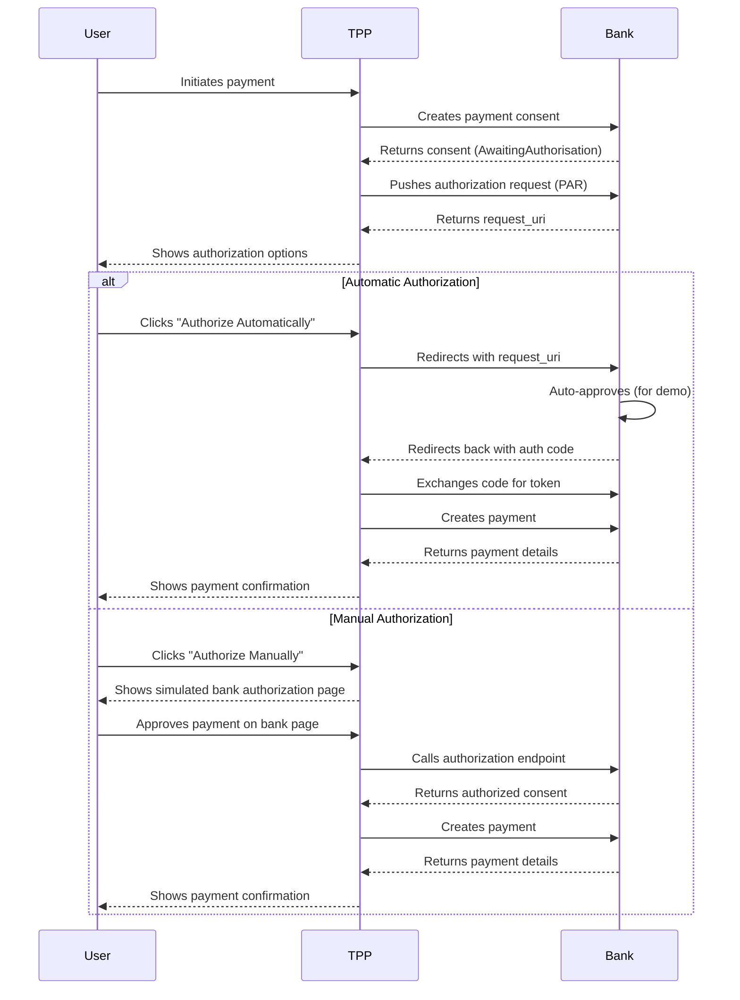

# Implementation Plan: NextJS Third-Party Provider with PAR and Hybrid Authorization

This document outlines the plan for implementing a NextJS third-party provider that can interact with banking APIs, incorporating Pushed Authorization Requests (PAR) and supporting both automated and manual authorization flows.

## 1. Mock Bank API Enhancements

### 1.1. Add PAR Endpoint
- Create a new endpoint: `POST /as/par` (Authorization Server PAR endpoint)
- This endpoint will:
  - Accept and validate authorization request parameters
  - Store the request and generate a request URI (`request_uri`)
  - Return the `request_uri` and expiration time

### 1.2. Update Authorization Endpoint
- Modify the authorization endpoint to:
  - Accept `request_uri` parameter
  - Retrieve the stored authorization request
  - Process the authorization request as before
  - Support both automated and manual authorization

### 1.3. Add Authorization Endpoint
- Create a new endpoint: `PUT /domestic-payment-consents/{consentId}/authorize`
- This endpoint will:
  - Change the consent status to "Authorised"
  - Return the updated consent object

### 1.4. Modify Consent Creation
- Remove the automatic setTimeout authorization
- Return a response that includes authorization URLs and options

## 2. TPP Application Implementation

### 2.1. API Client Updates
- Add PAR client function to push authorization requests
- Add consent authorization function
- Update payment flow to use PAR and wait for authorization

### 2.2. Authorization Flow Components
- Create an authorization page with:
  - Consent details display
  - "Authorize Automatically" button
  - "Authorize Manually" button
- Create a simulated bank authorization page

### 2.3. Payment Flow Implementation
- Update the payment flow to:
  1. Create a payment consent
  2. Push authorization request using PAR
  3. Show authorization options to user
  4. Process authorization (automatic or manual)
  5. Create payment after authorization is complete

## 3. User Experience Flow



## 4. Implementation Details

### 4.1. Mock Bank PAR Endpoint
```typescript
// POST /as/par
export const pushAuthorizationRequest = (req: Request, res: Response) => {
  try {
    // Validate client authentication
    // ...
    
    // Validate authorization request parameters
    // ...
    
    // Generate request_uri and store request
    const requestUri = `urn:ietf:params:oauth:request_uri:${uuid.v4()}`;
    const expiresIn = 60; // 60 seconds
    
    // Store the request for later retrieval
    storedAuthRequests.set(requestUri, {
      parameters: req.body,
      expiresAt: Date.now() + expiresIn * 1000
    });
    
    // Return the request_uri
    res.status(201).json({
      request_uri: requestUri,
      expires_in: expiresIn
    });
  } catch (error) {
    // Error handling
  }
};
```

### 4.2. TPP Payment Flow with PAR
```typescript
const initiatePayment = async (paymentData) => {
  try {
    // Step 1: Create a payment consent
    const consentResponse = await createPaymentConsent(paymentData);
    const consentId = consentResponse.Data.ConsentId;
    
    // Step 2: Push authorization request (PAR)
    const parResponse = await pushAuthorizationRequest({
      client_id: CLIENT_ID,
      response_type: 'code',
      scope: 'payments',
      redirect_uri: REDIRECT_URI,
      state: generateState(),
      code_challenge: generateCodeChallenge(),
      code_challenge_method: 'S256',
      consent_id: consentId
    });
    
    // Step 3: Show authorization options to user
    // (Automatic or Manual)
    
    // Step 4: After authorization is complete
    // Exchange authorization code for token
    
    // Step 5: Create payment using the token
    const paymentResponse = await createPayment(consentId);
    
    return paymentResponse;
  } catch (error) {
    console.error('Error in payment flow:', error);
    throw error;
  }
};
```

## 5. Implementation Phases

### Phase 1: Basic PAR Implementation
- Implement PAR endpoint in mock bank
- Update TPP to use PAR for authorization requests
- Fix the current payment flow issue

### Phase 2: Hybrid Authorization Flow
- Implement authorization options UI
- Add automatic authorization path
- Add manual authorization path with simulated bank page

### Phase 3: Testing and Refinement
- Test both authorization flows
- Add error handling and edge cases
- Improve user experience