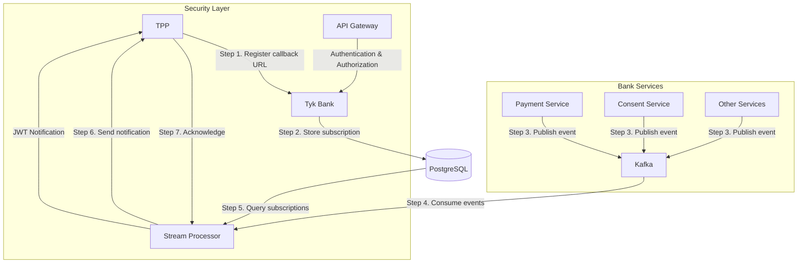

# Event Notifications System

This document describes the implementation of the event notification system for the Tyk Bank mock.

## Overview

The event notification system allows TPPs (Third Party Providers) to register callback URLs with the bank and receive notifications when certain events occur, such as payment status changes or consent authorizations.

The implementation follows the UK Open Banking Event Notifications and Events APIs specifications:
- Events API: Allows TPPs to register and manage callback URLs
- Event Notifications API: Allows the bank to push notifications to TPPs

## Architecture



## Components

### 1. PostgreSQL Database

The PostgreSQL database stores subscription registrations with a schema that maps to the current in-memory model:

```sql
CREATE TABLE event_subscriptions (
    id SERIAL PRIMARY KEY,
    subscription_id VARCHAR(50) NOT NULL UNIQUE,
    callback_url TEXT NOT NULL,
    version VARCHAR(10) NOT NULL,
    event_types TEXT[] NOT NULL,
    status VARCHAR(20) NOT NULL,
    creation_date_time TIMESTAMP WITH TIME ZONE NOT NULL,
    status_update_date_time TIMESTAMP WITH TIME ZONE NOT NULL
);
```

### 2. Kafka

Kafka is used as a message broker for events. The implementation uses Kafka with Zookeeper for cluster management.

### 3. Stream Processor

A stream processor is used as a webhook router/dispatcher. It consumes events from Kafka, queries PostgreSQL for active subscriptions, and sends notifications to the registered TPPs.

## Event Types

The following event types are supported:

| Event Type | Description | Trigger |
|------------|-------------|---------|
| `payment-consent-created` | A new payment consent is created | When a TPP creates a new payment consent |
| `payment-consent-authorised` | A payment consent is authorized | When a PSU authorizes a payment consent |
| `payment-consent-rejected` | A payment consent is rejected | When a PSU rejects a payment consent |
| `payment-created` | A new payment is created | When a TPP creates a new payment |
| `payment-completed` | A payment is completed | When a payment is successfully processed |
| `payment-failed` | A payment fails | When a payment processing fails |
| `funds-confirmation-completed` | A funds confirmation check is completed | When a funds confirmation check is performed |

## Security Considerations

For FAPI 2.0 compliance, the following security measures should be implemented:

1. **Authentication and Authorization**:
   - OAuth 2.0 for authenticating TPPs
   - Scope validation for event subscription management
   - API Gateway responsibility for authentication and authorization

3. **Transport Security**:
   - TLS 1.2+ for all communications
   - HTTPS for all endpoints
   - API Gateway responsibility for TLS termination

4. **Callback URL Validation**:
   - Validation of callback URLs before accepting them
   - Only accepting HTTPS URLs (except for development environments)
   - Support for query parameters in callback URLs

## Running the System

### Prerequisites

- Docker and Docker Compose
- Node.js and npm

### Starting the Services

Start all services using Docker Compose:
```bash
cd tyk-bank
docker-compose up -d
```

### Accessing the UIs

- PostgreSQL UI (Adminer): http://localhost:3432
- Kafka UI: http://localhost:3092

### Environment Variables

- `ENABLE_EVENTS`: Controls whether event functionality is enabled (default: false)
- `KAFKA_BROKER`: Kafka broker address (default: kafka:9092)
- `DB_HOST`: PostgreSQL host (default: postgres)
- `DB_PORT`: PostgreSQL port (default: 5432)
- `DB_USER`: PostgreSQL user (default: tyk_bank)
- `DB_PASSWORD`: PostgreSQL password (default: tyk_bank_password)
- `DB_NAME`: PostgreSQL database name (default: tyk_bank)

## API Endpoints

### Events API (Bank-side)

#### Register a Callback URL

```
POST /event-subscriptions
```

Request body:
```json
{
  "Data": {
    "CallbackUrl": "https://tpp.example.com/event-notifications",
    "Version": "1.0",
    "EventTypes": [
      "payment-completed",
      "payment-failed"
    ]
  }
}
```

#### Get All Subscriptions

```
GET /event-subscriptions
```

#### Get Subscription by ID

```
GET /event-subscriptions/{EventSubscriptionId}
```

#### Update Subscription

```
PUT /event-subscriptions/{EventSubscriptionId}
```

#### Delete Subscription

```
DELETE /event-subscriptions/{EventSubscriptionId}
```

### Event Notifications API (TPP-side)

#### Receive Notification

```
POST /event-notifications
```

The bank will send notifications to this endpoint with Content-Type "application/jwt" in the following format:

```json
{
  "iss": "https://tyk-bank.example.com",
  "iat": 1619712000,
  "jti": "evt-12345678",
  "aud": "https://tpp.example.com",
  "sub": "urn:uk:org:openbanking:payment:p-12345678",
  "txn": "txn-12345678",
  "toe": 1619712000,
  "events": {
    "urn:uk:org:openbanking:events:resource-update": {
      "subject": {
        "subject_type": "payment",
        "http://openbanking.org.uk/rid": "p-12345678",
        "http://openbanking.org.uk/rty": "payment",
        "http://openbanking.org.uk/rlk": [
          {
            "version": "1.0",
            "link": "https://tyk-bank.example.com/domestic-payments/p-12345678"
          }
        ]
      }
    }
  }
}
```

The notification is structured as a JWT but is not cryptographically signed. The `aud` field will contain the callback URL including any query parameters that were registered.