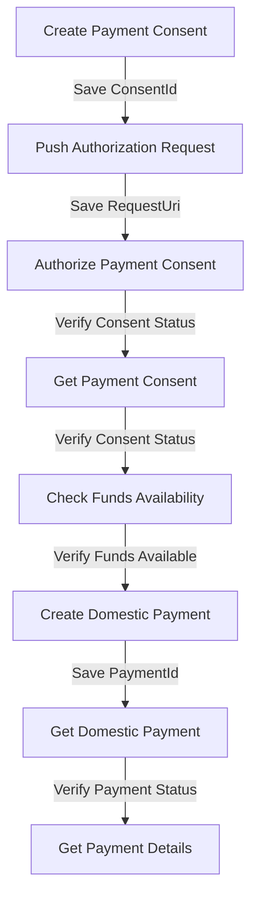

# Tyk-Bank Payment Initiation API - Postman Collection

This document provides instructions for testing the complete domestic payment flow in the Tyk-Bank Payment Initiation API using Postman.

## Quick Start - Import Ready-Made Collection

For your convenience, we've provided ready-made Postman files that you can import directly:

1. **Collection File**: [tyk-bank-payment-initiation.postman_collection.json](./tyk-bank-payment-initiation.postman_collection.json)
2. **Environment File**: [tyk-bank-payment-initiation.postman_environment.json](./tyk-bank-payment-initiation.postman_environment.json)

### Import Instructions

1. Open Postman
2. Click on "Import" button in the top left
3. Select the collection and environment JSON files
4. Select the imported environment from the environment dropdown in the top right
5. Open the collection and run the requests in sequence

The collection is pre-configured with test scripts that will automatically extract and store the necessary IDs between requests.

## Manual Setup Instructions

If you prefer to create the collection manually, follow the instructions below.

## Overview

The collection demonstrates the end-to-end domestic payment flow, from creating a consent to checking the final payment status. It uses environment variables and scripts to pass data between requests, making it a fully automated flow.

## Collection Structure



## Setup Instructions

### 1. Set Up Postman Environment

Create a new environment in Postman with the following variables:
- `baseUrl` (e.g., http://localhost:3002)
- `consentId` (leave empty, will be populated during execution)
- `requestUri` (leave empty, will be populated during execution)
- `paymentId` (leave empty, will be populated during execution)

### 2. Create the Collection

Create a new collection named "Tyk-Bank Payment Initiation API" and add the following requests:

## Requests

### 1. Create Payment Consent

- **Method**: POST
- **URL**: `{{baseUrl}}/domestic-payment-consents`
- **Headers**:
  - Content-Type: application/json
- **Body**:
```json
{
  "Data": {
    "Initiation": {
      "InstructionIdentification": "ACME412",
      "EndToEndIdentification": "FRESCO.21302.GFX.20",
      "InstructedAmount": {
        "Amount": "165.88",
        "Currency": "GBP"
      },
      "CreditorAccount": {
        "SchemeName": "UK.OBIE.SortCodeAccountNumber",
        "Identification": "08080021325698",
        "Name": "ACME Inc"
      },
      "RemittanceInformation": {
        "Reference": "FRESCO-101",
        "Unstructured": "Internal ops code 5120101"
      }
    }
  },
  "Risk": {}
}
```
- **Tests Script**:
```javascript
// Parse response
var jsonData = pm.response.json();

// Test status code
pm.test("Status code is 201", function () {
  pm.response.to.have.status(201);
});

// Test consent created successfully
pm.test("Consent created successfully", function () {
  pm.expect(jsonData.Data.ConsentId).to.exist;
});

// Save ConsentId to environment
if (jsonData.Data && jsonData.Data.ConsentId) {
  pm.environment.set("consentId", jsonData.Data.ConsentId);
}
```

### 2. Push Authorization Request (PAR)

- **Method**: POST
- **URL**: `{{baseUrl}}/as/par`
- **Headers**:
  - Content-Type: application/json
- **Body**:
```json
{
  "clientId": "test-client",
  "responseType": "code",
  "scope": "payments",
  "redirectUri": "http://localhost:3000/callback",
  "state": "state123",
  "consentId": "{{consentId}}"
}
```
- **Tests Script**:
```javascript
// Parse response
var jsonData = pm.response.json();

// Test status code
pm.test("Status code is 201", function () {
  pm.response.to.have.status(201);
});

// Test request_uri exists
pm.test("Request URI exists", function () {
  pm.expect(jsonData.request_uri).to.exist;
});

// Save request_uri to environment
if (jsonData.request_uri) {
  pm.environment.set("requestUri", jsonData.request_uri);
}
```

### 3. Authorize Payment Consent

- **Method**: PUT
- **URL**: `{{baseUrl}}/domestic-payment-consents/{{consentId}}/authorize`
- **Headers**:
  - Content-Type: application/json
- **Tests Script**:
```javascript
// Parse response
var jsonData = pm.response.json();

// Test status code
pm.test("Status code is 200", function () {
  pm.response.to.have.status(200);
});

// Test consent status is now Authorised
pm.test("Consent status is Authorised", function () {
  pm.expect(jsonData.Data.Status).to.eql("Authorised");
});
```

### 4. Get Payment Consent

- **Method**: GET
- **URL**: `{{baseUrl}}/domestic-payment-consents/{{consentId}}`
- **Tests Script**:
```javascript
// Parse response
var jsonData = pm.response.json();

// Test status code
pm.test("Status code is 200", function () {
  pm.response.to.have.status(200);
});

// Test consent status is Authorised
pm.test("Consent status is Authorised", function () {
  pm.expect(jsonData.Data.Status).to.eql("Authorised");
});
```

### 5. Check Funds Availability

- **Method**: GET
- **URL**: `{{baseUrl}}/domestic-payment-consents/{{consentId}}/funds-confirmation`
- **Tests Script**:
```javascript
// Parse response
var jsonData = pm.response.json();

// Test status code
pm.test("Status code is 200", function () {
  pm.response.to.have.status(200);
});

// Test funds availability
pm.test("Funds are available", function () {
  pm.expect(jsonData.Data.FundsAvailableResult.FundsAvailable).to.be.true;
});
```

### 6. Create Domestic Payment

- **Method**: POST
- **URL**: `{{baseUrl}}/domestic-payments`
- **Headers**:
  - Content-Type: application/json
- **Body**:
```json
{
  "Data": {
    "ConsentId": "{{consentId}}",
    "Initiation": {
      "InstructionIdentification": "ACME412",
      "EndToEndIdentification": "FRESCO.21302.GFX.20",
      "InstructedAmount": {
        "Amount": "165.88",
        "Currency": "GBP"
      },
      "CreditorAccount": {
        "SchemeName": "UK.OBIE.SortCodeAccountNumber",
        "Identification": "08080021325698",
        "Name": "ACME Inc"
      },
      "RemittanceInformation": {
        "Reference": "FRESCO-101",
        "Unstructured": "Internal ops code 5120101"
      }
    }
  },
  "Risk": {}
}
```
- **Tests Script**:
```javascript
// Parse response
var jsonData = pm.response.json();

// Test status code
pm.test("Status code is 201", function () {
  pm.response.to.have.status(201);
});

// Test payment created successfully
pm.test("Payment created successfully", function () {
  pm.expect(jsonData.Data.DomesticPaymentId).to.exist;
  pm.expect(jsonData.Data.Status).to.exist;
});

// Save PaymentId to environment
if (jsonData.Data && jsonData.Data.DomesticPaymentId) {
  pm.environment.set("paymentId", jsonData.Data.DomesticPaymentId);
}
```

### 7. Get Domestic Payment

- **Method**: GET
- **URL**: `{{baseUrl}}/domestic-payments/{{paymentId}}`
- **Tests Script**:
```javascript
// Parse response
var jsonData = pm.response.json();

// Test status code
pm.test("Status code is 200", function () {
  pm.response.to.have.status(200);
});

// Test payment status
pm.test("Payment status is valid", function () {
  const validStatuses = ["AcceptedSettlementInProcess", "AcceptedSettlementCompleted"];
  pm.expect(validStatuses).to.include(jsonData.Data.Status);
});
```

### 8. Get Payment Details

- **Method**: GET
- **URL**: `{{baseUrl}}/domestic-payments/{{paymentId}}/payment-details`
- **Tests Script**:
```javascript
// Parse response
var jsonData = pm.response.json();

// Test status code
pm.test("Status code is 200", function () {
  pm.response.to.have.status(200);
});

// Test payment details exist
pm.test("Payment details exist", function () {
  pm.expect(jsonData.Data.PaymentStatus).to.exist;
});
```

## Running the Collection

1. Select the environment you created
2. Open the collection runner
3. Select all requests in the correct order
4. Run the collection

The collection will execute each request in sequence, passing the ConsentId and PaymentId between requests using environment variables. The tests will verify that each step completes successfully.

## Expected Results

- A payment consent is created
- An authorization request is pushed (PAR)
- The payment consent is authorized
- Funds availability is confirmed
- A domestic payment is created
- The payment status is verified
- Payment details are retrieved

This collection demonstrates the complete end-to-end flow of the domestic payment process in the Tyk-Bank Payment Initiation API, including the FAPI 2.0 Security Profile features like Pushed Authorization Requests (PAR) and explicit consent authorization.